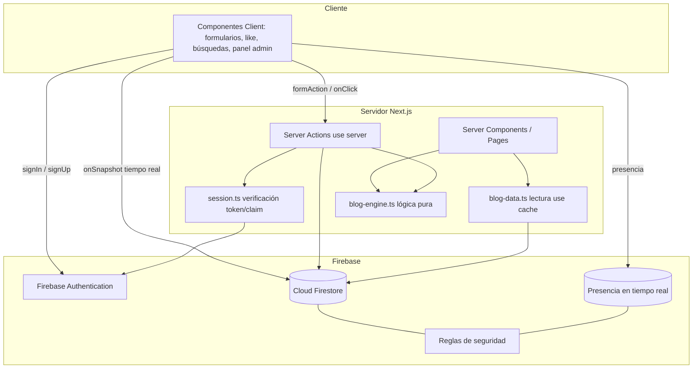
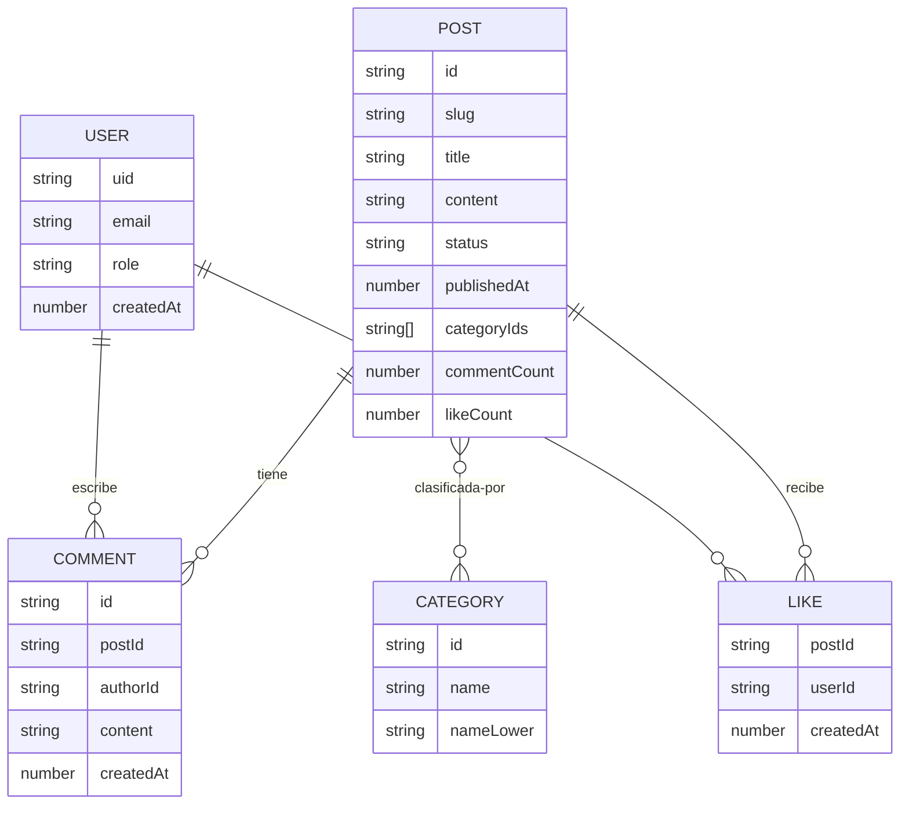

# Design Document

## Overview

Esta sección de Blog se integra en el sitio SCG (Next.js 16.2.6 modificado, App Router, React 19, Ant Design v6, Tailwind v4, tema oscuro, idioma español). Añade contenido público (listado, detalle, sección destacada en la home, enlace en la cabecera), un sistema de cuentas basado en Firebase Authentication para comentar y dar «me gusta», un panel de administración oculto bajo `/admin` (dashboard con métricas y mapa de presencia, gestión de suscriptores y de entradas/categorías) y la actualización de las páginas legales.

El diseño sigue dos principios ya establecidos en el repositorio:

1. **Separación de la lógica pura.** Igual que `app/mejor-ruta/route-engine.ts`, toda la lógica de ordenación, filtrado, paginación, validación, selección de destacados, conmutación de «me gusta» y agregación de métricas vive en un módulo sin dependencias de React/Next/Firebase: `app/blog/blog-engine.ts`. Esto permite probar las reglas con `fast-check` (ya instalado) de forma determinista, sin tocar la red.
2. **Server Components por defecto, `"use client"` solo donde hay interactividad.** Las páginas obtienen datos en el servidor; los componentes interactivos (formularios de comentario/registro, control de «me gusta», búsquedas, panel admin) son Client Components que invocan Server Actions o el SDK de cliente de Firebase.

### Restricción de plataforma (Next.js modificado)

Antes de implementar cada ruta/layout/componente, DEBE consultarse la documentación incluida en `node_modules/next/dist/docs/`. Hallazgos relevantes para este diseño, extraídos de esa documentación:

- **Proxy en lugar de Middleware.** Desde Next.js 16 el antiguo _middleware_ se llama **Proxy** (`proxy.ts` en la raíz del proyecto, un único archivo por proyecto). Se usará para una comprobación optimista de acceso a `/admin`, no como solución de autorización completa (la autorización real se valida en cada Server Action y en las Reglas de Firestore). Fuente: `docs/01-app/01-getting-started/16-proxy.md`.
- **`unstable_instant` + Cache Components.** Las rutas que deben navegar de forma instantánea exportan `export const unstable_instant = { prefetch: 'static' }` y envuelven los datos no cacheados en `<Suspense>`; los datos estables se marcan con la directiva `use cache`. La validación se ejecuta en desarrollo y build. Las rutas dinámicas con datos de usuario/tiempo real (p. ej. el layout de `/admin`) pueden exceptuarse con `export const unstable_instant = false`. Fuente: `docs/01-app/02-guides/instant-navigation.md`.
- **Server Functions / Server Actions.** Las mutaciones usan funciones `"use server"` que **siempre** verifican autenticación y autorización en su interior (son alcanzables por POST directo). Tras mutar se usa `refresh()` de `next/cache` o `revalidatePath`/`revalidateTag`. Fuente: `docs/01-app/01-getting-started/07-mutating-data.md`.
- **Manejo de errores.** `not-found.tsx` + `notFound()` para entradas inexistentes o en borrador; `error.tsx` (Client Component) recibe `error` y `unstable_retry` para fallos de carga. Fuente: `docs/01-app/01-getting-started/10-error-handling.md`.
- **`params` es una Promesa** que debe esperarse (`await params`), y `viewport`/`themeColor` viven en el export `viewport` (ya aplicado en `app/layout.tsx`).

### Dependencias

El proyecto ya incluye `lib/firebase/config.ts` (SDK de cliente: `firebase/app`, `firebase/auth`, `firebase/firestore`, `firebase/storage`, `firebase/analytics`) y `lib/firebase/admin.ts` (Admin SDK: `firebase-admin`). Los paquetes `firebase` y `firebase-admin` **no aparecen todavía en `package.json`** y deberán instalarse durante la implementación (`firebase` y `firebase-admin`). Para validación de formularios se reutilizará `zod` (ya instalado). Las pruebas usan `vitest` + `fast-check` (ya instalados).

## Architecture

### Mapa de rutas (App Router)

```
app/
├── blog/
│   ├── page.tsx                      # Listado público paginado (Server Component)
│   ├── loading.tsx                   # Skeleton del listado
│   ├── error.tsx                     # Fallo de carga del contenido (Req 1.12)
│   ├── BlogListClient.tsx            # "use client": filtro de categoría + paginación UI
│   ├── blog-engine.ts                # Lógica pura (sin React/Next/Firebase) — testeable con PBT
│   ├── blog-data.ts                  # Acceso de lectura a Firestore (Server, "use cache")
│   ├── types.ts                      # Tipos de dominio compartidos
│   ├── categoria/
│   │   └── [categoria]/page.tsx      # Listado filtrado por categoría (Req 1.4, 1.10)
│   └── [slug]/
│       ├── page.tsx                  # Detalle de entrada (Server Component)
│       ├── not-found.tsx             # 404 para borrador/inexistente (Req 2.6, 2.7)
│       ├── CommentsSection.tsx       # "use client": lista + formulario de comentarios
│       └── LikeButton.tsx            # "use client": control de «me gusta»
├── admin/
│   ├── layout.tsx                    # Guard de sesión admin; unstable_instant = false
│   ├── login/page.tsx                # Formulario de login admin (Req 6)
│   ├── page.tsx                      # Dashboard: 4 métricas + mapa (Req 7, 8)
│   ├── usuarios/page.tsx             # Gestión de suscriptores (Req 9)
│   └── entradas/page.tsx             # Gestión de entradas y categorías (Req 10)
├── components/SiteHeader.tsx         # + enlace «Blog» (Req 12)
├── politica-de-privacidad/page.tsx   # Actualización legal (Req 13)
└── terminos-y-condiciones/page.tsx   # Actualización legal (Req 14)

lib/blog/
├── actions.ts                        # Server Actions: comentar, like, CRUD admin ("use server")
├── auth-actions.ts                   # Server Actions: registro/login/logout, sesión admin
├── session.ts                        # Verificación de ID token / custom claim (server-only)
└── presence.ts                       # Servicio de presencia (cliente + lectura admin)

proxy.ts                              # Comprobación optimista de /admin (raíz del proyecto)
firestore.rules                       # Reglas de seguridad (Req 9.6, 10.10, 15)
```

### Capas y responsabilidades



Decisión de diseño: **doble línea de defensa de autorización.** Las Server Actions verifican el ID token y el custom claim de administrador antes de escribir, y las Reglas de Firestore vuelven a validar las mismas condiciones (Req 15, 9.6, 10.10). Las escrituras de tiempo real desde el cliente (comentarios, «me gusta», presencia) pasan directamente por el SDK de cliente y quedan protegidas exclusivamente por las Reglas de Firestore; por eso las reglas son la frontera de seguridad autoritativa para esas operaciones.

### Modelo de tiempo real

- **Comentarios y «me gusta» (Req 4.9, 5.9):** el detalle de entrada se suscribe con `onSnapshot` de Firestore a la subcolección de comentarios y al contador de «me gusta», de modo que las actualizaciones aparecen en ≤ 3 s sin recarga.
- **Presencia (Req 8):** patrón de presencia basado en Firebase. Cada cliente registra una conexión con marca de tiempo (`lastSeen`) y una ubicación geográfica aproximada opcional; un _heartbeat_ refresca `lastSeen`. Las conexiones inactivas > 60 s se consideran caducadas. El Dashboard se suscribe al conjunto de conexiones activas. La selección de conexiones vigentes y el conteo se calculan con funciones puras de `blog-engine.ts` para poder testearlas.

## Components and Interfaces

### Lógica pura — `app/blog/blog-engine.ts`

Módulo sin dependencias de framework (espejo de `route-engine.ts`). Firmas:

```ts
// Ordenación del listado: solo publicadas, fecha desc y, en empate, título asc.
export function orderPublishedPosts(posts: Post[]): Post[];

// Filtra solo publicadas que pertenecen a la categoría dada (preserva el orden).
export function filterByCategory(posts: Post[], categoryId: string): Post[];

// Particiona en páginas de tamaño fijo (<= pageSize) preservando el orden.
export function paginate<T>(
  items: T[],
  pageSize: number,
  pageIndex: number,
): {
  items: T[];
  pageIndex: number;
  totalPages: number;
};

// Validación de contenido de comentario: longitud efectiva 1..2000 tras recorte.
export type CommentValidation =
  | { ok: true; value: string }
  | { ok: false; error: "vacio" | "excede_limite" };
export function validateCommentContent(raw: string): CommentValidation;

// Validación de registro: email con formato válido y contraseña >= 8 caracteres.
export type RegistrationValidation =
  | { ok: true }
  | { ok: false; errors: { email?: string; password?: string } };
export function validateRegistration(
  email: string,
  password: string,
): RegistrationValidation;

// Conmutación de «me gusta». likedBy es el conjunto de usuarios que ya dieron like.
export function toggleLike(
  likedBy: ReadonlySet<string>,
  userId: string,
): {
  likedBy: Set<string>;
  liked: boolean;
  count: number;
};

// Selección de destacados (Req 11): más reciente + top por comentarios, sin repetir.
export function selectFeatured(posts: Post[], count: number): Post[];

// Número de destacados según ancho de viewport (Req 11.6-11.8).
export function featuredCountForWidth(width: number): 1 | 2 | 3;

// Búsqueda de usuarios por email, insensible a mayúsculas (Req 9.5).
export function searchUsersByEmail(users: BlogUser[], term: string): BlogUser[];

// Validación de entrada de blog (Req 10.2, 10.9, 10.12).
export type PostValidation =
  | { ok: true }
  | { ok: false; field: "titulo" | "contenido" | "categorias" };
export function validatePost(
  title: string,
  content: string,
  categoryIds: string[],
): PostValidation;

// ¿El nombre de categoría ya existe? (insensible a may/min, Req 10.7).
export function isCategoryNameTaken(
  existing: Category[],
  name: string,
): boolean;

// Métricas del dashboard a partir de los datos (Req 7.1-7.4).
export function computeDashboardMetrics(
  posts: Post[],
  comments: Comment[],
  likes: Like[],
): {
  totalPosts: number;
  postsWithComments: number;
  totalComments: number;
  totalLikes: number;
};

// Conexiones de presencia vigentes según ventana de inactividad (Req 8.4).
export function activeConnections(
  conns: PresenceConnection[],
  nowMs: number,
  ttlMs: number,
): PresenceConnection[];

// ¿Coordenadas mapeables? lat ∈ [-90,90], lng ∈ [-180,180] (Req 8.6, 8.7).
export function isMappableLocation(
  loc: GeoLocation | null | undefined,
): boolean;

// ¿El enlace «Blog» de la cabecera está activo? (Req 12.3).
export function isBlogLinkActive(pathname: string): boolean;
```

Constantes exportadas: `POSTS_PER_PAGE = 10`, `COMMENT_MAX = 2000`, `TITLE_MAX = 200`, `CONTENT_MAX = 50000`, `CATEGORY_NAME_MAX = 50`, `CATEGORY_MIN = 1`, `CATEGORY_MAX = 10`, `PASSWORD_MIN = 8`, `FEATURED_TOTAL = 3`, `PRESENCE_TTL_MS = 60_000`.

### Acceso a datos de lectura — `app/blog/blog-data.ts` (Server)

Funciones de servidor que leen Firestore y devuelven tipos de dominio. Las consultas de contenido publicado estable se marcan con `use cache`; las páginas las componen y aplican `blog-engine`.

```ts
export async function getPublishedPosts(): Promise<Post[]>;
export async function getPublishedPostBySlug(
  slug: string,
): Promise<Post | null>; // null si no existe o es borrador
export async function getCategories(): Promise<Category[]>;
export async function getFeaturedPosts(): Promise<Post[]>; // usa selectFeatured con FEATURED_TOTAL
export async function getAdminMetricsData(): Promise<{
  posts: Post[];
  comments: Comment[];
  likes: Like[];
}>;
```

### Server Actions — `lib/blog/actions.ts` y `lib/blog/auth-actions.ts`

Cada acción comprueba sesión/rol antes de mutar y devuelve estado de error como valor (patrón `useActionState`), no mediante excepciones para errores esperados.

```ts
// Cuentas
registerUser(state, formData); // Req 3.1, 3.4, 3.5, 3.8, 3.9
loginUser(state, formData); // Req 3.2, 3.3, 3.9
logoutUser(); // Req 3.6
adminLogin(state, formData); // Req 6.2, 6.3, 6.4
adminLogout(); // Req 6.7

// Comentarios y likes (verifican auth; las reglas son la frontera autoritativa)
createComment(state, formData); // Req 4.2, 4.5, 4.6, 4.7
toggleLikeAction(postId); // Req 5.4, 5.5, 5.6, 5.7, 5.8

// Admin: entradas y categorías
createPost / updatePost / publishPost / deletePost; // Req 10.2-10.5, 10.9, 10.12
createCategory / deleteCategory; // Req 10.6-10.8
deleteUser / updateUserRole; // Req 9.3, 9.4
```

### Componentes de UI (resumen)

| Componente                            | Tipo          | Responsabilidad                                           | Requisitos                   |
| ------------------------------------- | ------------- | --------------------------------------------------------- | ---------------------------- |
| `blog/page.tsx`                       | Server        | Listado publicado ordenado y paginado                     | 1.1, 1.2, 1.3, 1.5–1.9, 1.11 |
| `blog/categoria/[categoria]/page.tsx` | Server        | Listado filtrado por categoría                            | 1.4, 1.10                    |
| `BlogListClient.tsx`                  | Client        | UI de paginación y navegación de categorías               | 1.8, 1.9                     |
| `blog/[slug]/page.tsx`                | Server        | Detalle: título, contenido, fecha, categorías, contadores | 2.1–2.5, 2.8, 2.9            |
| `CommentsSection.tsx`                 | Client        | Lista en tiempo real + formulario condicionado a sesión   | 4.1, 4.3, 4.4, 4.8, 4.9      |
| `LikeButton.tsx`                      | Client        | Estado activado/desactivado + conteo en tiempo real       | 5.1, 5.2, 5.3, 5.9           |
| `SiteHeader.tsx`                      | Client        | Enlace «Blog» en barra y drawer, estado activo            | 12.1–12.6                    |
| home (`HomeFeaturedBlog`)             | Client        | Sección destacada responsive como primera sección         | 11.1–11.10                   |
| `admin/login/page.tsx`                | Client        | Login admin                                               | 6.1–6.3                      |
| `admin/page.tsx`                      | Server+Client | Dashboard 4 métricas + mapa presencia                     | 7.1–7.7, 8.1–8.8             |
| `admin/usuarios/page.tsx`             | Server+Client | Lista, búsqueda, eliminar, cambiar rol                    | 9.1–9.5                      |
| `admin/entradas/page.tsx`             | Server+Client | CRUD entradas y categorías                                | 10.1–10.12                   |

### Control de acceso a `/admin`

- `proxy.ts` (raíz) hace una comprobación **optimista** de la cookie de sesión y redirige a `/admin/login` cuando no hay indicio de sesión (Req 6.5). No es autoritativo.
- `app/admin/layout.tsx` verifica en el servidor el ID token y el custom claim `admin === true` (vía `lib/blog/session.ts` + Admin SDK) e impide renderizar cualquier vista distinta del login sin sesión válida (Req 6.8, 6.4). Exporta `unstable_instant = false` por ser dinámico.
- La Cabecera y el pie **no** contienen ningún enlace ni referencia a `/admin` (Req 6.6).

## Data Models

### Tipos de dominio — `app/blog/types.ts`

```ts
export type PublicationStatus = "borrador" | "publicada";

export interface Post {
  id: string;
  slug: string; // identificador de ruta legible
  title: string; // 1..200
  content: string; // 1..50000
  status: PublicationStatus;
  publishedAt: number | null; // epoch ms; null mientras es borrador
  createdAt: number;
  updatedAt: number;
  categoryIds: string[]; // 0..10 (0 solo posible tras desasociar categoría)
  commentCount: number; // entero >= 0 (denormalizado)
  likeCount: number; // entero >= 0 (denormalizado)
}

export interface Category {
  id: string;
  name: string; // 1..50
  nameLower: string; // name.toLowerCase() para unicidad/búsqueda
}

export interface Comment {
  id: string;
  postId: string;
  authorId: string; // uid del Usuario_Registrado
  content: string; // 1..2000
  createdAt: number; // epoch ms
}

export interface Like {
  postId: string;
  userId: string; // clave compuesta: máx. un like por (userId, postId)
  createdAt: number;
}

export type UserRole = "suscriptor" | "admin";

export interface BlogUser {
  uid: string;
  email: string;
  role: UserRole;
  createdAt: number;
}

export interface GeoLocation {
  lat: number;
  lng: number;
}

export interface PresenceConnection {
  connectionId: string;
  lastSeen: number; // epoch ms
  location?: GeoLocation | null;
}
```

### Colecciones de Firestore

```
posts/{postId}                       -> Post (sin contadores duplicados de subcolecciones)
posts/{postId}/comments/{commentId}  -> Comment
posts/{postId}/likes/{userId}        -> Like   (id del doc = userId ⇒ máx. 1 like/usuario/entrada, Req 5.6)
categories/{categoryId}              -> Category
users/{uid}                          -> BlogUser
presence/{connectionId}              -> PresenceConnection
```

Decisiones:

- **`likeCount`/`commentCount` denormalizados** en el documento de entrada, actualizados de forma transaccional al crear/eliminar like o comentario, para mostrar contadores sin contar documentos en cada lectura (Req 2.8, 2.9, 5.1) y para alimentar métricas del dashboard. Las métricas del dashboard se calculan agregando estos campos / contando documentos según convenga (Req 7).
- **Like como documento con id = `userId`** dentro de la subcolección de la entrada: garantiza estructuralmente «máx. un like por usuario y entrada» (Req 5.6) y simplifica las reglas de propiedad (Req 15.3).
- **`nameLower`** permite comprobar unicidad de categoría y buscar usuarios sin distinción de may/min mediante igualdad/prefijo (la búsqueda de subcadena se aplica en memoria con `searchUsersByEmail`, Req 9.5, 10.7).
- **`slug`** se usa como segmento de ruta del detalle; si una entrada no tiene slug se puede usar su `id`. El detalle responde 404 (`notFound()`) si el slug no resuelve o el estado es `borrador` (Req 2.6, 2.7).
- **Borrado en cascada** (Req 10.5, 10.8): eliminar una entrada borra su subcolección de comentarios y likes; eliminar una categoría la quita de `categoryIds` de cada entrada que la referencia. Se ejecuta en el servidor con el Admin SDK por lotes.

### Diagrama de relaciones



## Correctness Properties

_A property is a characteristic or behavior that should hold true across all valid executions of a system — essentially, a formal statement about what the system should do. Properties serve as the bridge between human-readable specifications and machine-verifiable correctness guarantees._

Estas propiedades aplican a la **capa de lógica pura** (`app/blog/blog-engine.ts`), que no depende de React, Next ni Firebase y por tanto es idónea para pruebas basadas en propiedades con `fast-check`. La autenticación de Firebase, las escrituras a Firestore, las Reglas de seguridad, la presencia en tiempo real, el renderizado de UI y el contenido legal se validan con pruebas de integración, ejemplo o snapshot (ver Testing Strategy), no con PBT.

### Property 1: Solo las entradas publicadas son visibles públicamente

_For any_ conjunto de entradas con estados mezclados, `orderPublishedPosts` no devuelve ninguna entrada en estado `borrador`, y `getPublishedPostBySlug` devuelve `null` siempre que el slug consultado corresponde a una entrada en `borrador` o no existe ninguna entrada con ese slug.

**Validates: Requirements 1.1, 2.6, 2.7**

### Property 2: Orden del listado por fecha descendente y título ascendente

_For any_ conjunto de entradas publicadas, `orderPublishedPosts` produce una secuencia en la que cada entrada tiene una fecha de publicación mayor o igual que la siguiente y, cuando dos entradas comparten fecha de publicación, aparecen ordenadas entre sí por título en orden alfabético ascendente.

**Validates: Requirements 1.2, 1.3**

### Property 3: Filtrado por categoría devuelve solo publicadas de esa categoría

_For any_ conjunto de entradas y cualquier identificador de categoría, todas las entradas devueltas por `filterByCategory` están en estado `publicada` y tienen ese identificador en sus categorías, y ninguna entrada publicada de esa categoría queda omitida.

**Validates: Requirements 1.4, 1.10**

### Property 4: La paginación particiona la lista ordenada sin huecos ni solapamientos

_For any_ lista ordenada de entradas y cualquier tamaño de página, cada página devuelta por `paginate` contiene como máximo `POSTS_PER_PAGE` (10) elementos y la concatenación de todas las páginas en orden reproduce exactamente la lista original, sin duplicar ni omitir ningún elemento y preservando el orden.

**Validates: Requirements 1.8, 1.9**

### Property 5: Validación de contenido de comentario por longitud efectiva

_For any_ cadena de entrada, `validateCommentContent` la acepta si y solo si su longitud tras recortar espacios está entre 1 y `COMMENT_MAX` (2000); rechaza con error `"vacio"` las cadenas vacías o compuestas solo por espacios en blanco y con error `"excede_limite"` las que superan 2000 caracteres.

**Validates: Requirements 4.6, 4.7**

### Property 6: Validación de registro por email y contraseña

_For any_ par (email, contraseña), `validateRegistration` lo acepta si y solo si el email tiene un formato válido y la contraseña tiene al menos `PASSWORD_MIN` (8) caracteres; en caso contrario devuelve un error en el campo correspondiente (email, contraseña o ambos).

**Validates: Requirements 3.1, 3.5**

### Property 7: Conmutar «me gusta» es una involución que mantiene un único like por usuario

_For any_ conjunto de usuarios que ya dieron «me gusta» y cualquier usuario, aplicar `toggleLike` una vez añade al usuario e incrementa el contador en 1 si estaba ausente, o lo elimina y decrementa en 1 si estaba presente; aplicar `toggleLike` dos veces sobre el mismo usuario restaura el conjunto y el contador originales, y la pertenencia al conjunto nunca permite contar a un mismo usuario más de una vez.

**Validates: Requirements 5.4, 5.5, 5.6**

### Property 8: Las métricas del dashboard agregan correctamente los datos

_For any_ conjunto de entradas, comentarios y «me gusta», `computeDashboardMetrics` devuelve `totalPosts` igual al número de entradas, `postsWithComments` igual al número de entradas con al menos un comentario asociado, `totalComments` igual al número total de comentarios y `totalLikes` igual al número total de «me gusta», siendo las cuatro métricas enteros mayores o iguales a 0.

**Validates: Requirements 7.1, 7.2, 7.3, 7.4**

### Property 9: Las conexiones inactivas quedan excluidas del conjunto activo

_For any_ conjunto de conexiones de presencia, un instante actual y una ventana de inactividad `ttl`, `activeConnections` devuelve exactamente las conexiones cuya antigüedad (`now - lastSeen`) no supera `ttl` y excluye todas las que la superan.

**Validates: Requirements 8.4**

### Property 10: El total de conectados incluye todas las conexiones activas y el mapa solo las geolocalizables

_For any_ conjunto de conexiones activas, el número total de conectados es un entero mayor o igual a 0 igual al número de conexiones activas, el subconjunto representado en el mapa es exactamente el de conexiones con una ubicación cuyo `lat ∈ [-90, 90]` y `lng ∈ [-180, 180]`, y el tamaño de ese subconjunto nunca supera el total.

**Validates: Requirements 8.1, 8.6, 8.7**

### Property 11: Búsqueda de usuarios por email insensible a mayúsculas

_For any_ lista de usuarios y cualquier término de búsqueda, toda entrada devuelta por `searchUsersByEmail` tiene un email que contiene el término sin distinción de mayúsculas y minúsculas, y toda entrada excluida tiene un email que no lo contiene.

**Validates: Requirements 9.5**

### Property 12: Validación de entrada de blog por longitud y número de categorías

_For any_ combinación de título, contenido y lista de categorías, `validatePost` la acepta si y solo si el título tiene entre 1 y `TITLE_MAX` (200) caracteres, el contenido entre 1 y `CONTENT_MAX` (50000) caracteres y el número de categorías entre `CATEGORY_MIN` (1) y `CATEGORY_MAX` (10); en caso contrario indica el primer campo inválido (`titulo`, `contenido` o `categorias`).

**Validates: Requirements 10.2, 10.9, 10.12**

### Property 13: Unicidad de nombre de categoría insensible a mayúsculas

_For any_ conjunto de categorías existentes y cualquier nombre candidato, `isCategoryNameTaken` devuelve verdadero si y solo si existe una categoría cuyo nombre coincide con el candidato ignorando diferencias de mayúsculas y minúsculas.

**Validates: Requirements 10.6, 10.7**

### Property 14: Selección de entradas destacadas

_For any_ conjunto de entradas publicadas y cualquier cantidad objetivo `count`, `selectFeatured` devuelve una lista cuyo primer elemento es la entrada publicada más reciente, cuyos elementos restantes son las entradas con mayor número de comentarios (desempatando por fecha de publicación más reciente), sin repetir ninguna entrada, y cuyo tamaño es el mínimo entre `count` y el número de entradas publicadas disponibles.

**Validates: Requirements 11.2, 11.3, 11.4, 11.5, 11.9**

### Property 15: Número de destacados según el ancho de la ventana

_For any_ ancho de ventana gráfica, `featuredCountForWidth` devuelve 3 cuando el ancho es mayor o igual a 1024, 2 cuando está entre 768 y 1023 inclusive, y 1 cuando es menor que 768.

**Validates: Requirements 11.6, 11.7, 11.8**

### Property 16: Estado activo del enlace «Blog» en la cabecera

_For any_ ruta (`pathname`), `isBlogLinkActive` devuelve verdadero si y solo si la ruta es exactamente `/blog` o comienza por el segmento `/blog/`, y falso en cualquier otra ruta.

**Validates: Requirements 12.3**

## Error Handling

### Carga de contenido público

- **Fallo al recuperar entradas (Req 1.12):** `app/blog/error.tsx` (Client Component con `error` y `unstable_retry`) muestra un mensaje en español indicando que el contenido no pudo cargarse y ofrece reintentar. La página nunca renderiza un listado parcial: si `getPublishedPosts` lanza, el `error.tsx` reemplaza todo el segmento.
- **Entrada inexistente o en borrador (Req 2.6, 2.7):** `getPublishedPostBySlug` devuelve `null`; la página llama a `notFound()` y se renderiza `app/blog/[slug]/not-found.tsx`.
- **Entrada sin categorías (Req 2.5):** el render comprueba `categoryIds.length > 0` antes de mostrar la sección de categorías; con lista vacía omite la sección sin error.

### Cuentas y sesión

- **Credenciales inválidas (Req 3.3):** mensaje genérico en español que no distingue si falló el email o la contraseña; el estado permanece no autenticado.
- **Email duplicado / formato inválido / contraseña corta (Req 3.4, 3.5):** `validateRegistration` rechaza antes de llamar a Firebase; los errores de Firebase (p. ej. `auth/email-already-in-use`) se traducen a mensajes en español.
- **Fallo de comunicación con Auth (Req 3.9):** se captura la excepción del SDK y se devuelve un estado de error en español conservando el estado no autenticado.
- **Errores esperados** se modelan como valores de retorno de las Server Actions (patrón `useActionState`), no como excepciones; los errores inesperados burbujean al `error.tsx` más cercano.

### Comentarios y «me gusta»

- **Operación no autenticada (Req 4.5, 5.7):** las Reglas de Firestore rechazan la escritura (permiso denegado); la UI muestra un mensaje en español invitando a iniciar sesión y no modifica los contadores.
- **Validación de comentario (Req 4.6, 4.7):** `validateCommentContent` decide el mensaje (`"El contenido es obligatorio"` / `"Se superó el límite de 2000 caracteres"`).
- **Fallo de like (Req 5.8):** actualización optimista con _rollback_: si la transacción falla, la UI restaura el estado y el contador previos y muestra un mensaje en español.

### Panel de administración

- **Acceso no autorizado (Req 6.4, 6.5, 6.8):** `proxy.ts` redirige optimistamente; `app/admin/layout.tsx` verifica el custom claim en el servidor y redirige a `/admin/login` o muestra mensaje de no autorizado. Ninguna vista admin se renderiza sin claim válido.
- **Fallo de métrica del dashboard (Req 7.7):** cada métrica se carga de forma independiente; si una falla muestra su propio mensaje de error sin exhibir valores parciales o incorrectos para esa métrica (las demás siguen mostrándose).
- **Presencia no disponible (Req 8.8):** si el servicio no responde en 10 s, el mapa muestra una indicación de error y conserva el último conteo conocido.

### Validación de entradas y categorías (admin)

- **Campos inválidos (Req 10.9, 10.12):** `validatePost` devuelve el campo ofensivo y la UI muestra el mensaje en español correspondiente sin modificar los datos previos.
- **Nombre de categoría duplicado (Req 10.7):** `isCategoryNameTaken` bloquea la creación y se muestra el error «el nombre ya existe», conservando la categoría existente.

## Testing Strategy

El proyecto ya usa `vitest` + `fast-check` con la convención de archivos `*.property.test.ts`, `*.unit.test.ts` y `*.integration.test.ts` dentro de carpetas `__tests__/` (ver `app/mejor-ruta/__tests__/`). El Blog sigue esa convención en `app/blog/__tests__/` y `lib/blog/__tests__/`.

### Pruebas basadas en propiedades (PBT)

Aplican a la lógica pura de `app/blog/blog-engine.ts`. Requisitos:

- Se usa **fast-check** (ya instalado); no se implementa PBT desde cero.
- Cada propiedad de la sección Correctness Properties se implementa con **una única** prueba basada en propiedades.
- Cada prueba se configura con **mínimo 100 iteraciones** (`{ numRuns: 100 }`).
- Cada prueba se etiqueta con un comentario y un `describe` que referencia la propiedad del diseño, con el formato:
  **`Feature: blog, Property {número}: {texto de la propiedad}`**
- Los generadores deben producir casos límite deliberadamente: estados mezclados borrador/publicada, fechas y títulos colisionantes, cadenas de solo espacios y de longitud justo en los límites (0, 1, 2000, 2001; 200/201; 50000/50001), conjuntos de «me gusta» vacíos y repetidos, conexiones con `lastSeen` dentro y fuera del `ttl`, coordenadas en y fuera de rango, listas de categorías de tamaño 0, 1, 10 y 11, y anchos de viewport en los límites 767/768/1023/1024.

Mapa propiedad → archivo de prueba (orientativo):

| Propiedad                   | Archivo                                    |
| --------------------------- | ------------------------------------------ |
| 1 Visibilidad de publicadas | `publication-visibility.property.test.ts`  |
| 2 Orden del listado         | `ordering.property.test.ts`                |
| 3 Filtro por categoría      | `category-filter.property.test.ts`         |
| 4 Paginación                | `pagination.property.test.ts`              |
| 5 Validación de comentario  | `comment-validation.property.test.ts`      |
| 6 Validación de registro    | `registration-validation.property.test.ts` |
| 7 Conmutación de like       | `like-toggle.property.test.ts`             |
| 8 Métricas del dashboard    | `dashboard-metrics.property.test.ts`       |
| 9 Presencia (ttl)           | `presence-ttl.property.test.ts`            |
| 10 Conteo/mapa de presencia | `presence-mapping.property.test.ts`        |
| 11 Búsqueda de usuarios     | `user-search.property.test.ts`             |
| 12 Validación de entrada    | `post-validation.property.test.ts`         |
| 13 Unicidad de categoría    | `category-uniqueness.property.test.ts`     |
| 14 Selección de destacados  | `featured-selection.property.test.ts`      |
| 15 Destacados por viewport  | `featured-count.property.test.ts`          |
| 16 Enlace Blog activo       | `blog-link-active.property.test.ts`        |

### Pruebas unitarias y de ejemplo

Para comportamiento concreto y de UI (no universal):

- Render de listado y detalle: título, fecha y categorías visibles; mensajes de estado vacío de `/blog`, de categoría sin entradas, de sin entradas en admin (Req 1.5–1.7, 1.10, 1.11, 2.1–2.4, 10.11).
- Detalle muestra contadores enteros (Req 2.8, 2.9) y la cabecera contiene el enlace «Blog» al nivel de «Wiki» y oculta toda referencia a `/admin` (Req 12.1, 6.6).
- Indicadores de carga del dashboard y mensajes de error de métrica/presencia (Req 7.6, 7.7, 8.8).
- Comportamiento condicionado a sesión en comentarios y like: formulario visible/oculto, invitación a login (Req 4.1, 4.3, 4.4, 5.1–5.3).
- _Rollback_ optimista del like ante fallo (Req 5.8) y mensaje de credenciales inválidas (Req 3.3).
- Páginas legales: presencia de los apartados requeridos y fecha de última actualización (Req 13, 14).

### Pruebas de integración

Para comportamiento de servicios externos (Firebase) y de las Reglas de Firestore. Se recomienda el **emulador de Firebase** (Auth + Firestore) con 1–3 ejemplos representativos por caso:

- **Reglas de Firestore (Req 15.1–15.8, 9.6, 10.10):** lectura pública de publicadas y sus comentarios/likes; rechazo de escrituras no autenticadas; propiedad de comentario/like por `userId`; rechazo de modificación de datos ajenos; permisos de admin para entradas/categorías; rechazo de lectura de borradores por no-admin. Se prueban con casos permitidos y denegados.
- **Auth + cuentas (Req 3.2, 3.4, 3.6, 3.7, 3.8):** login correcto, email duplicado, logout, persistencia de sesión, creación del registro de usuario con rol `suscriptor`.
- **Acceso admin (Req 6.2, 6.4, 6.5, 6.7, 6.8):** claim de admin concede acceso; ausencia de claim deniega; redirección a login; logout.
- **Escrituras de contenido (Req 4.2, 9.3, 9.4, 10.3, 10.4, 10.5, 10.8):** persistencia de comentario; eliminación de usuario en Firestore + Auth; cambio de rol; edición conservando estado; publicación con fecha actual; borrado en cascada de entrada (comentarios/likes) y desasociación al borrar categoría.
- **Tiempo real (Req 4.9, 5.9, 8.2, 8.3, 8.5):** una suscripción `onSnapshot` refleja la inserción de un comentario / el cambio de contador / el alta y baja de presencia dentro de los plazos indicados.

### Verificación

Tras la implementación se ejecutará `npm test` (vitest `--run`) para las pruebas unitarias y de propiedades, y `npm run build` para validar las exportaciones `unstable_instant` y la estructura de Cache Components. Las pruebas que requieren emulador de Firebase se ejecutan por separado y se documentará el comando en la fase de tareas.
