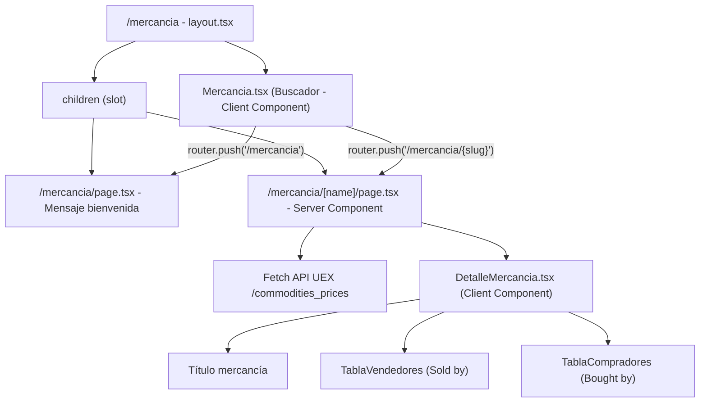
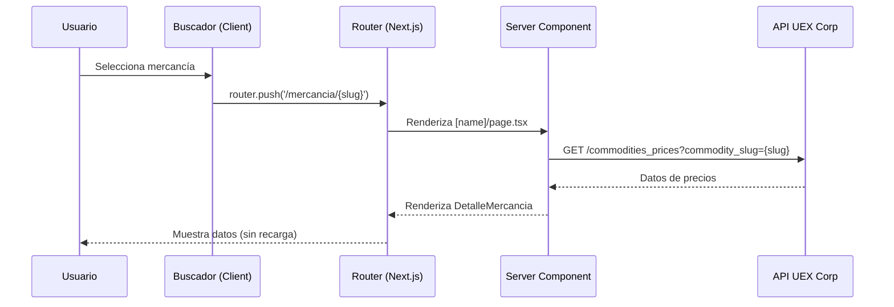
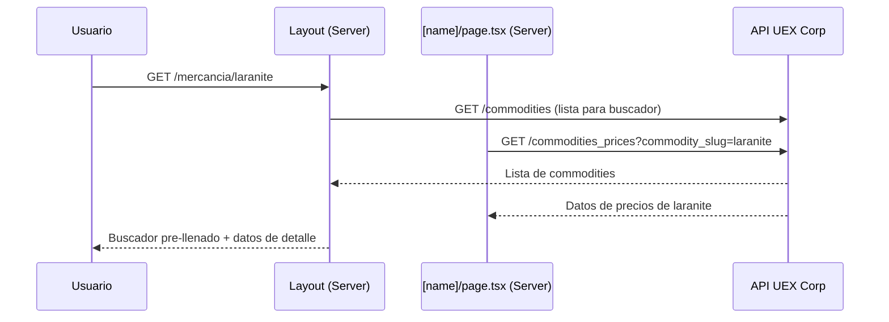

# Documento de Diseño — Vista de Detalle de Mercancía

## Resumen

Este diseño implementa la vista de detalle de mercancía como una experiencia de página única (SPA-like) dentro del App Router de Next.js. El usuario busca una mercancía en `/mercancia`, la selecciona, y los datos de precios aparecen debajo del buscador sin recarga de página. La URL se actualiza a `/mercancia/{slug}` mediante navegación del lado del cliente. Si el usuario llega directamente a `/mercancia/{slug}`, el buscador se pre-llena y los datos se cargan automáticamente.

### Decisiones Clave de Diseño

1. **Layout compartido con estado cliente**: Se usa un layout de ruta (`app/mercancia/layout.tsx`) que contiene el componente `Mercancia` (buscador). El contenido de detalle se renderiza como `children` del layout, permitiendo que el buscador persista entre navegaciones.
2. **Navegación con `router.push`**: Al seleccionar una mercancía, se usa `useRouter().push()` para actualizar la URL sin recarga completa, aprovechando el soft navigation de Next.js.
3. **Fetch en servidor para datos de precios**: La página `[name]/page.tsx` es un Server Component que obtiene los datos de la API UEX y los pasa al componente cliente de visualización.
4. **Slug como parámetro de ruta**: Se usa el campo `slug` de la API de commodities (o se deriva del nombre) como segmento de URL.

## Arquitectura



### Flujo de Datos



### Flujo de Acceso Directo por URL



## Componentes e Interfaces

### Estructura de Archivos

```
app/mercancia/
├── layout.tsx              # Layout compartido - fetch de commodities + renderiza Buscador
├── page.tsx                # Página índice - mensaje de bienvenida
├── Mercancia.tsx           # Componente buscador (Client Component) - REFACTORIZADO
├── DetalleMercancia.tsx    # Componente de visualización de detalle (Client Component)
├── TablaPrecios.tsx        # Componente tabla reutilizable para vendedores/compradores
├── types.ts                # Tipos TypeScript compartidos
├── utils.ts                # Funciones utilitarias (formateo, construcción de ubicación)
└── [name]/
    └── page.tsx            # Server Component - fetch de precios por slug
```

### Componentes

#### 1. `layout.tsx` (Server Component)

Responsabilidad: Obtener la lista de commodities y renderizar el buscador como elemento persistente.

```typescript
// Props: children (React.ReactNode)
// Fetch: GET /commodities → lista para autocompletado
// Renderiza: Buscador + {children}
```

#### 2. `Mercancia.tsx` (Client Component) — Refactorizado

Responsabilidad: Buscador con autocompletado. Navega al seleccionar, limpia al borrar.

```typescript
interface MercanciaProps {
  commoditiesList: CommodityOption[];
  initialSlug?: string; // Para pre-llenar cuando se accede por URL directa
}

// Comportamiento:
// - onSelect → router.push(`/mercancia/${slug}`)
// - onClear → router.push('/mercancia')
// - Si initialSlug → pre-llenar input con nombre correspondiente
```

#### 3. `page.tsx` (raíz `/mercancia`) (Server Component)

Responsabilidad: Mostrar mensaje de bienvenida cuando no hay mercancía seleccionada.

```typescript
// Renderiza un mensaje invitando al usuario a buscar
// No muestra tablas ni datos
```

#### 4. `[name]/page.tsx` (Server Component)

Responsabilidad: Obtener datos de precios de la API y pasarlos al componente de detalle.

```typescript
// Params: { name: string } (el slug)
// Fetch: GET /commodities_prices?commodity_slug={name}
// Renderiza: <DetalleMercancia data={processedData} /> o mensaje de error
```

#### 5. `DetalleMercancia.tsx` (Client Component)

Responsabilidad: Renderizar el título y las dos tablas de precios.

```typescript
interface DetalleMercanciaProps {
  commodityName: string;
  sellers: TerminalPriceRecord[]; // Terminales que venden (price_buy > 0)
  buyers: TerminalPriceRecord[]; // Terminales que compran (price_sell > 0)
}
```

#### 6. `TablaPrecios.tsx` (Client Component)

Responsabilidad: Tabla reutilizable para mostrar terminales con precios.

```typescript
interface TablaPreciosProps {
  title: string;
  records: TerminalPriceRecord[];
  type: "sellers" | "buyers"; // Determina qué columnas mostrar
  emptyMessage: string;
}
```

#### 7. `utils.ts`

Funciones puras para formateo y transformación de datos.

```typescript
// buildHierarchicalLocation(record): string
// formatPrice(price: number): string
// formatStock(available: number, max?: number | null): string
// slugToName(slug: string): string
// separateRecords(data: ApiPriceRecord[]): { sellers, buyers }
```

## Modelos de Datos

### Tipos de la API UEX Corp

```typescript
/** Respuesta del endpoint GET /commodities */
interface ApiCommodity {
  id: number;
  id_parent: number | null;
  name: string;
  code: string;
  slug: string;
  kind: string | null;
  weight_scu: number | null;
  price_buy: number;
  price_sell: number;
  is_available: number;
  is_available_live: number;
  is_visible: number;
}

/** Respuesta del endpoint GET /commodities_prices */
interface ApiPriceRecord {
  id: number;
  id_commodity: number;
  id_terminal: number;
  id_star_system: number;
  id_planet: number;
  id_orbit: number;
  id_moon: number;
  id_city: number;
  id_outpost: number;
  id_poi: number;
  id_faction: number;
  // Precios
  price_buy: number;
  price_sell: number;
  // Stock (compra por jugador - lo que la terminal vende)
  scu_buy: number;
  scu_buy_max: number;
  // Demanda (venta por jugador - lo que la terminal compra)
  scu_sell: number;
  scu_sell_max: number;
  // Nombres de ubicación
  commodity_name: string;
  commodity_slug: string;
  star_system_name: string | null;
  planet_name: string | null;
  orbit_name: string | null;
  moon_name: string | null;
  space_station_name: string | null;
  outpost_name: string | null;
  city_name: string | null;
  terminal_name: string;
  terminal_slug: string;
  terminal_code: string;
  // Metadatos
  game_version: string;
  date_modified: number;
}
```

### Tipos Internos de la Aplicación

```typescript
/** Opción para el autocompletado del buscador */
interface CommodityOption {
  id: number;
  name: string;
  slug: string;
}

/** Registro procesado de terminal con precio */
interface TerminalPriceRecord {
  id: number;
  terminalName: string;
  location: string; // Ubicación jerárquica construida
  price: number; // price_buy o price_sell según contexto
  stockAvailable: number; // scu_buy o scu_sell según contexto
  stockMax: number | null; // scu_buy_max o scu_sell_max
}

/** Datos procesados para la vista de detalle */
interface CommodityDetailData {
  commodityName: string;
  sellers: TerminalPriceRecord[]; // Ordenados por precio ascendente
  buyers: TerminalPriceRecord[]; // Ordenados por precio descendente
}
```

### Lógica de Transformación

**Construcción de Ubicación Jerárquica:**

```
buildHierarchicalLocation(record) →
  [star_system_name, planet_name, orbit_name, moon_name, city_name, space_station_name, outpost_name]
    .filter(Boolean)
    .join(" > ")
```

**Separación de Registros:**

- `sellers` = registros donde `price_buy > 0` → ordenados por `price_buy` ASC
- `buyers` = registros donde `price_sell > 0` → ordenados por `price_sell` DESC

**Formato de Precios:**

- `formatPrice(1234.56)` → `"1,234.56 UEC"` (usando `Intl.NumberFormat`)

**Formato de Stock:**

- `formatStock(500, 1000)` → `"500 / 1,000 SCU"`
- `formatStock(500, null)` → `"500 SCU"`

## Propiedades de Correctitud

_Una propiedad es una característica o comportamiento que debe mantenerse verdadero en todas las ejecuciones válidas de un sistema — esencialmente, una declaración formal sobre lo que el sistema debe hacer. Las propiedades sirven como puente entre especificaciones legibles por humanos y garantías de correctitud verificables por máquina._

### Propiedad 1: Separación correcta de registros

_Para cualquier_ lista de registros de precios de la API, la función `separateRecords` debe producir dos listas donde: (a) todos los registros en `sellers` tienen `price_buy > 0`, (b) todos los registros en `buyers` tienen `price_sell > 0`, y (c) ningún registro con `price_buy > 0` está ausente de `sellers` y ningún registro con `price_sell > 0` está ausente de `buyers`.

**Valida: Requisitos 2.2, 4.1, 5.1**

### Propiedad 2: Construcción de ubicación jerárquica

_Para cualquier_ registro de la API con una combinación arbitraria de campos de ubicación (algunos nulos, algunos con valor), la función `buildHierarchicalLocation` debe producir una cadena que: (a) contiene exactamente los valores no nulos, (b) los separa con " > ", (c) no contiene segmentos vacíos ni separadores al inicio/final, y (d) preserva el orden jerárquico (sistema > planeta > órbita > luna > ciudad > estación > outpost).

**Valida: Requisitos 6.2, 6.3**

### Propiedad 3: Formato de precios

_Para cualquier_ número no negativo, la función `formatPrice` debe producir una cadena que: (a) termina con " UEC", (b) contiene separadores de miles correctos, y (c) al parsear el componente numérico de vuelta a número, produce un valor equivalente al original (round-trip numérico).

**Valida: Requisitos 7.1**

### Propiedad 4: Formato de stock y demanda

_Para cualquier_ par de valores (disponible, máximo) donde disponible es un número no negativo: si máximo es un número no nulo, el resultado debe seguir el formato "{disponible} / {máximo} SCU"; si máximo es nulo o indefinido, el resultado debe seguir el formato "{disponible} SCU". En ambos casos, los números deben tener separadores de miles.

**Valida: Requisitos 7.2, 7.3**

### Propiedad 5: Ordenamiento correcto de registros

_Para cualquier_ lista de registros de terminales: (a) cuando se ordena como vendedores (sellers), cada elemento debe tener un precio menor o igual al siguiente (orden ascendente por `price_buy`); (b) cuando se ordena como compradores (buyers), cada elemento debe tener un precio mayor o igual al siguiente (orden descendente por `price_sell`).

**Valida: Requisitos 4.3, 5.3**

## Manejo de Errores

### Errores de API

| Escenario                                | Comportamiento                                                 |
| ---------------------------------------- | -------------------------------------------------------------- |
| API retorna HTTP 4xx/5xx                 | Mostrar mensaje: "No se encontraron datos para esta mercancía" |
| API retorna respuesta vacía (`data: []`) | Mostrar mensaje: "No se encontraron datos para esta mercancía" |
| API retorna JSON inválido                | Mostrar mensaje genérico de error                              |
| Timeout de red                           | Mostrar mensaje: "Error de conexión. Intenta de nuevo."        |

### Errores de Navegación

| Escenario                               | Comportamiento                                              |
| --------------------------------------- | ----------------------------------------------------------- |
| Slug no corresponde a ninguna mercancía | Mostrar mensaje de "no encontrado" con sugerencia de buscar |
| URL con caracteres inválidos            | Next.js maneja el 404 por defecto                           |

### Estrategia de Error Boundaries

- El componente `DetalleMercancia` no necesita error boundary propio; el manejo se hace en el Server Component (`[name]/page.tsx`) con try/catch alrededor del fetch.
- Si el fetch falla, se renderiza un componente de mensaje de error en lugar de `DetalleMercancia`.

## Estrategia de Testing

### Tests Unitarios (ejemplo)

| Componente/Función          | Qué se testea                                         |
| --------------------------- | ----------------------------------------------------- |
| `buildHierarchicalLocation` | Combinaciones de campos nulos/no-nulos                |
| `formatPrice`               | Números con decimales, enteros, ceros                 |
| `formatStock`               | Con máximo, sin máximo, valores cero                  |
| `separateRecords`           | Lista vacía, solo vendedores, solo compradores, mixta |
| `slugToName`                | Conversión de slug a nombre legible                   |

### Tests de Propiedades (Property-Based Testing)

**Librería**: `fast-check` (compatible con el ecosistema TypeScript/Jest/Vitest)

**Configuración**: Mínimo 100 iteraciones por propiedad.

Cada test de propiedad debe:

- Referenciar la propiedad del documento de diseño
- Usar el formato de tag: **Feature: commodity-detail-view, Property {número}: {texto}**
- Generar inputs aleatorios usando los arbitrarios de `fast-check`

| Propiedad                   | Generador de Inputs                                                                |
| --------------------------- | ---------------------------------------------------------------------------------- |
| P1: Separación de registros | Lista de `ApiPriceRecord` con `price_buy` y `price_sell` aleatorios (incluyendo 0) |
| P2: Ubicación jerárquica    | Objeto con 7 campos de ubicación, cada uno `string \| null` aleatorio              |
| P3: Formato de precios      | Números flotantes no negativos                                                     |
| P4: Formato de stock        | Pares `(number, number \| null)`                                                   |
| P5: Ordenamiento            | Listas de registros con precios aleatorios                                         |

### Tests de Integración

| Escenario                             | Qué se verifica                                  |
| ------------------------------------- | ------------------------------------------------ |
| Navegación buscador → detalle         | URL se actualiza, datos se muestran              |
| Acceso directo por URL                | Buscador pre-llenado, datos cargados             |
| Limpieza del buscador                 | URL vuelve a `/mercancia`, mensaje de bienvenida |
| API retorna error                     | Mensaje de error visible                         |
| Lista vacía de vendedores/compradores | Mensaje "no hay terminales" visible              |

### Tests de Ejemplo (Edge Cases)

- Mercancía sin vendedores (todos `price_buy = 0`)
- Mercancía sin compradores (todos `price_sell = 0`)
- Registro con todas las ubicaciones nulas excepto `terminal_name`
- Precio con muchos decimales (ej: `0.001`)
- Stock máximo = 0
