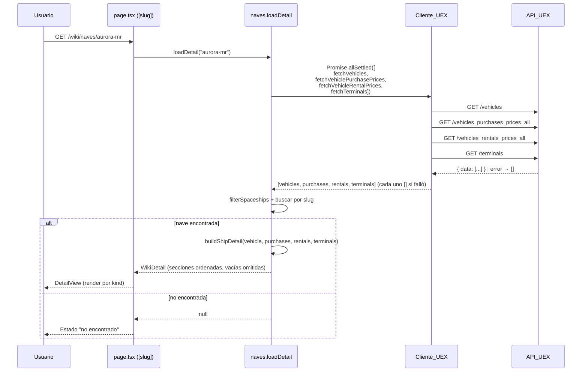
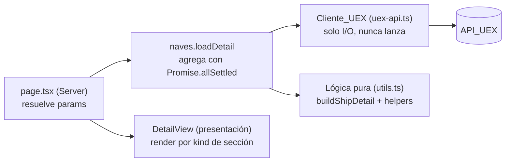

# Design Document

## Overview

Esta funcionalidad es una **mejora incremental** del **Detalle_Elemento** de la wiki (spec `wiki`). Hoy, el detalle de una Nave en `/wiki/naves/[slug]` muestra un `WikiDetail` con una lista plana de campos (`fields`) y una lista de `classifications`. Esta mejora persigue dos objetivos:

1. **Generalizar el modelo de detalle** (`WikiDetail`) en un conjunto de **secciones componibles** tipadas (`DetailSection[]`), de modo que las categorías futuras puedan añadir, reordenar u omitir bloques sin rediseñar la página de detalle ni sus presentaciones.
2. **Enriquecer el detalle de Nave** con datos completos de la API pública de UEX Corp (`https://api.uexcorp.uk/2.0`, sin autenticación): ficha técnica ampliada, galería de imágenes, tablas de precios de compra/alquiler en aUEC con resolución de ubicaciones, y enlaces externos oficiales.

El diseño **conserva** todas las convenciones ya establecidas en la spec `wiki`:

- Cliente_UEX (`app/wiki/uex-api.ts`) que **nunca lanza**, devuelve `[]` en error, usa `next: { revalidate }`, lee de `json.data` y prefiere endpoints masivos `*_all`.
- Lógica pura aislada en `app/wiki/utils.ts`, cubierta con tests de propiedades (vitest 4 + fast-check 4).
- Server Components por defecto, islas `"use client"` solo para interacción.
- Marcador de Dato_Faltante (`MISSING_DATA = "Dato no disponible"`), estados "no encontrado" y estados vacíos.

El layout es una **mejora incremental** del detalle actual (se añaden los bloques de galería, precios y enlaces); **no** es un rediseño ni un clon de starcitizen.tools.

### Investigación y decisiones de framework

Conforme a `AGENTS.md` y a `node_modules/next/dist/docs/`, se confirmaron las convenciones de esta versión modificada de Next.js (App Router):

- **`params` es un `Promise`** y se resuelve con `await` en el Server Component del detalle (`01-app/01-getting-started/03-layouts-and-pages.md`). El `page.tsx` actual ya lo hace; se conserva.
- El proyecto **no usa Cache Components**, por lo que aplica el modelo `fetch(..., { next: { revalidate } })` (`01-app/02-guides/caching-without-cache-components.md`). Es el patrón ya usado por el Cliente_UEX.
- **Galería de imágenes**: la documentación de `next/image` (`01-app/01-getting-started/12-images.md`) exige declarar `images.remotePatterns` en `next.config.ts` para hosts remotos y aportar `width`/`height` (o `fill`) manualmente. Las URLs de UEX (`url_photo`, `url_photos`) apuntan a **hosts externos arbitrarios y desconocidos de antemano**, y el `next.config.ts` actual no define `remotePatterns`. Por ello, **el Bloque_Galeria usa el elemento `` nativo** (con `loading="lazy"` y `alt` explícito), evitando acoplar la feature a una lista de hosts permitidos que cambiaría con cada nuevo proveedor de imágenes de UEX. Es una decisión deliberada y reversible: si en el futuro se acota el conjunto de hosts, puede migrarse a `next/image` añadiendo `remotePatterns`. Se documenta el trade-off (sin optimización automática de imágenes).
- Navegación de regreso con `<Link>` de `next/link` (ya en uso).

Fuentes consultadas (locales): `node_modules/next/dist/docs/01-app/01-getting-started/03-layouts-and-pages.md`, `.../12-images.md`, `.../02-guides/caching-without-cache-components.md`; y la guía de la API en `.kiro/steering/uex-corp-api.md`.

## Architecture

### Alcance del cambio

La mejora se circunscribe a la rama del Detalle_Elemento y a los módulos compartidos de la wiki:

```
app/wiki/types.ts                       → + campos ApiVehicle, + tipos de precios/terminal, + DetailSection (unión), WikiDetail generalizado
app/wiki/utils.ts                       → + helpers puros (parsePhotoUrls, buildPriceRows, buildLocationNameResolver, buildExternalLinks, buildGalleryImages), activeClassifications ampliado, buildShipDetail re-escrito a secciones
app/wiki/uex-api.ts                     → + fetchVehiclePurchasePrices, fetchVehicleRentalPrices, fetchTerminals
app/wiki/categories/naves.ts            → loadDetail agrega 4 fuentes con Promise.allSettled
app/wiki/[category]/[slug]/DetailView.tsx → renderiza secciones en orden + sub-renderer por kind
```

Las rutas y páginas genéricas (`page.tsx` del detalle) **no cambian su contrato**: siguen resolviendo `params` y delegando en `category.loadDetail(slug)`.

### Flujo de datos del detalle enriquecido



### Capas



- **Cliente_UEX**: I/O contra `/vehicles`, `/vehicles_purchases_prices_all`, `/vehicles_rentals_prices_all`, `/terminals`. Nunca lanza, devuelve `[]`.
- **Lógica pura**: parseo, filtrado, resolución de nombres, composición de secciones. Es lo que se cubre con tests de propiedades.
- **naves.loadDetail**: orquesta la agregación resiliente y compone el `WikiDetail`.
- **DetailView**: presentación; selecciona un sub-renderer según el `kind` de cada sección.

### Principio de extensibilidad (modelo de secciones)

El detalle deja de ser una lista plana de campos para ser una **lista ordenada de secciones componibles** tipadas mediante una **unión discriminada** por el campo `kind`. La página y `DetailView` **no conocen "naves"**: iteran las secciones en orden y, por cada una, despachan al renderer correspondiente a su `kind`. Añadir un bloque nuevo a una categoría futura = devolver una sección más desde su adaptador; añadir un tipo de bloque nuevo = añadir un `kind` a la unión y un renderer en `DetailView`. Las páginas no cambian.

## Components and Interfaces

### Cliente_UEX — `app/wiki/uex-api.ts`

Se añaden tres funciones siguiendo **exactamente** el patrón de `fetchVehicles` (Accept: application/json, sin Authorization, `next.revalidate` en [3300, 3900], `json.data ?? []`, `try/catch` → `console.error` + `[]`).

```ts
/**
 * Precios de compra de vehículos en todas las ubicaciones. Endpoint masivo
 * *_all (un único request, sin fan-out por nave). TTL ~1h.
 */
export async function fetchVehiclePurchasePrices(): Promise<
  ApiVehiclePurchasePrice[]
>;

/**
 * Precios de alquiler de vehículos en todas las ubicaciones. Endpoint masivo
 * *_all. TTL ~1h.
 */
export async function fetchVehicleRentalPrices(): Promise<
  ApiVehicleRentalPrice[]
>;

/**
 * Lista de terminales para resolver el nombre completo de cada Ubicacion_Juego.
 * Endpoint masivo. TTL ~1h.
 */
export async function fetchTerminals(): Promise<ApiTerminal[]>;
```

Comportamiento garantizado (idéntico a `fetchVehicles`):

- Cabecera `Accept: application/json`, **sin** `Authorization` (Req 6.1).
- Endpoints masivos `*_all` (Req 6.2): `GET /vehicles_purchases_prices_all`, `GET /vehicles_rentals_prices_all`, `GET /terminals`.
- `next: { revalidate: 3600 }` (dentro de [3300, 3900] s) (Req 6.3).
- Lee `json.data ?? []` (Req 6.4).
- `try/catch`: ante excepción o `!result.ok`, hace `console.error` y devuelve `[]` (Req 6.5).

### Categoría "naves" — `app/wiki/categories/naves.ts`

`loadItems` **no cambia** (sigue usando solo `fetchVehicles`). `loadDetail` se reescribe para agregar las cuatro fuentes con **`Promise.allSettled`** (Req 6.6), de modo que el fallo de un origen no impide mostrar los demás:

```ts
async function loadDetail(slug: string): Promise<WikiDetail | null> {
  const [vehiclesR, purchasesR, rentalsR, terminalsR] =
    await Promise.allSettled([
      fetchVehicles(),
      fetchVehiclePurchasePrices(),
      fetchVehicleRentalPrices(),
      fetchTerminals(),
    ]);

  const vehicles = vehiclesR.status === "fulfilled" ? vehiclesR.value : [];
  const purchases = purchasesR.status === "fulfilled" ? purchasesR.value : [];
  const rentals = rentalsR.status === "fulfilled" ? rentalsR.value : [];
  const terminals = terminalsR.status === "fulfilled" ? terminalsR.value : [];

  const ship = filterSpaceships(vehicles).find(
    (v) => toSlug(resolveShipName(v)) === slug,
  );
  if (!ship) return null;

  return buildShipDetail(ship, purchases, rentals, terminals);
}
```

> Como el Cliente_UEX ya nunca lanza, las promesas casi siempre resuelven `fulfilled` con `[]` en error; `Promise.allSettled` añade una segunda red de seguridad y cumple explícitamente Req 6.6/6.7.

### Detalle_Elemento — `app/wiki/[category]/[slug]/page.tsx`

**Sin cambios de contrato.** Resuelve `params: Promise<{ category, slug }>`, busca la categoría, gestiona "no encontrado" y delega en `DetailView`. La firma `WikiDetail` que recibe `DetailView` cambia (de `fields/classifications` a `sections`), pero el page sigue pasando el objeto tal cual.

### Presentación — `app/wiki/[category]/[slug]/DetailView.tsx`

Se reescribe el cuerpo para **renderizar las secciones en orden** (Req 1.3) y **seleccionar el sub-renderer según `kind`** (Req 1.4). Conserva el encabezado (título + subtítulo, Req 1.6) y el enlace "Volver al listado" (Req 1.7).

```tsx
export default function DetailView({ detail }: { detail: WikiDetail }) {
  return (
    <div className="...">
      <Link href={`/wiki/${detail.categoryId}`}>← Volver al listado</Link>
      <header>
        <h1>{detail.title}</h1>
        <p>{detail.subtitle}</p>
      </header>
      {detail.sections.map((section, i) => (
        <SectionRenderer key={`${section.kind}-${i}`} section={section} />
      ))}
    </div>
  );
}

function SectionRenderer({ section }: { section: DetailSection }) {
  switch (section.kind) {
    case "fields":
      return <FieldsSection section={section} />;
    case "gallery":
      return <GallerySection section={section} />;
    case "prices":
      return <PricesSection section={section} />;
    case "links":
      return <LinksSection section={section} />;
  }
}
```

Sub-renderers (todos Server Components presentacionales, sin estado):

- **`FieldsSection`** — reutiliza la presentación actual de la lista plana: título de grupo (`label`) + `<dl>` de pares etiqueta/valor, renderizando `string[]` como lista ordenada (p. ej. `container_sizes`). Cubre la migración de la presentación de campos existente.
- **`GallerySection`** — imagen principal (`mainImage`) + miniaturas (`images[]`) con ``; el `alt` se deriva de `altBase` (nombre de la Nave) (Req 3.5).
- **`PricesSection`** — encabezado según `operation` ("Comprar" / "Alquilar") + tabla de filas `{ locationName, price }` con el importe formateado en **aUEC** (Req 4.2, 4.3, 4.9).
- **`LinksSection`** — lista de enlaces; cada uno con `target="_blank"` y `rel="noopener noreferrer"` (Req 5.3) y su etiqueta de tipo (Req 5.2).

> **Compatibilidad / migración**: el `DetailView.test.tsx` actual construye `WikiDetail` con `fields`/`classifications` y verifica clasificaciones como "tags" y campos en un `<dl>`. Tras la migración:
>
> - Las clasificaciones de la Nave pasan a vivir dentro de la **sección `fields` de Ficha_Tecnica** (o como un grupo de campos dedicado), de modo que `DetailView` ya no lee `detail.classifications`.
> - Los fixtures de `DetailView.test.tsx` deben reconstruirse con la forma `sections`.
> - Las aserciones de "Volver al listado", título y subtítulo se conservan.
>   Estas actualizaciones de tests se detallan en Testing Strategy → "Impacto en tests existentes".

## Data Models

### Tipos de la API (`app/wiki/types.ts`)

`ApiVehicle` se **amplía** con los campos nuevos de `/vehicles`. Todos los campos nuevos son **opcionales/anulables** (diseño defensivo: la API es comunitaria y no todos los registros traen todos los campos).

```ts
export interface ApiVehicle {
  // --- existentes ---
  id: number;
  name: string;
  name_full: string | null;
  scu: number | null;
  crew: string | null;
  is_spaceship: number; // 0 | 1
  is_cargo: number; // 0 | 1
  is_ground_vehicle: number; // 0 | 1
  container_sizes: string | null;
  pad_type: string | null;
  company_name: string | null;

  // --- nuevos: dimensiones y físicas ---
  mass?: number | null;
  width?: number | null;
  height?: number | null;
  length?: number | null;

  // --- nuevos: combustible y versión ---
  fuel_quantum?: number | null;
  fuel_hydrogen?: number | null;
  game_version?: string | null;

  // --- nuevos: imágenes y enlaces ---
  url_photo?: string | null; // imagen principal
  url_photos?: string | null; // array de URLs codificado como cadena JSON
  url_store?: string | null;
  url_brochure?: string | null;
  url_video?: string | null;
  url_hotsite?: string | null;

  // --- nuevos: identidad ---
  uuid?: string | null;
  slug?: string | null;

  // --- nuevos: clasificación ampliada (0 | 1; pueden faltar) ---
  is_mining?: number | null;
  is_salvage?: number | null;
  is_refinery?: number | null;
  is_scanning?: number | null;
  is_exploration?: number | null;
  is_military?: number | null;
  is_civilian?: number | null;
  is_medical?: number | null;
  is_racing?: number | null;
  is_stealth?: number | null;
}
```

> El conjunto `is_*` ampliado se trata **defensivamente**: cada indicador puede ser `1`, `0`, `null` o estar ausente. `activeClassifications` solo añade la etiqueta cuando el valor es exactamente `1`.

```ts
/** Fila de GET /vehicles_purchases_prices_all (conjunto reducido relevante). */
export interface ApiVehiclePurchasePrice {
  id_vehicle: number;
  id_terminal: number;
  price_buy: number;
  vehicle_name?: string | null;
  terminal_name?: string | null;
}

/** Fila de GET /vehicles_rentals_prices_all (conjunto reducido relevante). */
export interface ApiVehicleRentalPrice {
  id_vehicle: number;
  id_terminal: number;
  price_rent: number;
  vehicle_name?: string | null;
  terminal_name?: string | null;
}

/** Subconjunto de GET /terminals para resolver el nombre de la Ubicacion_Juego. */
export interface ApiTerminal {
  id: number;
  name: string;
  nickname?: string | null;
  star_system_name?: string | null;
  planet_name?: string | null;
  city_name?: string | null;
  space_station_name?: string | null;
}
```

### Modelo de dominio generalizado (`app/wiki/types.ts`)

El `WikiDetail` deja de tener `fields`/`classifications` planos y pasa a tener `sections: DetailSection[]`. `DetailField` se conserva sin cambios (lo reutiliza el bloque de campos).

```ts
/** Un campo ya formateado para la vista de detalle (sin cambios). */
export interface DetailField {
  label: string;
  value: string | string[];
}

/** Operación de un Bloque_Precios. */
export type PriceOperation = "buy" | "rent";

/** Fila de un Bloque_Precios: ubicación + importe en aUEC. */
export interface PriceRow {
  locationName: string;
  price: number; // aUEC
}

/** Tipo de un Enlace_Externo. */
export type ExternalLinkType = "store" | "brochure" | "video" | "hotsite";

/** Un Enlace_Externo ya resuelto. */
export interface LinkEntry {
  type: ExternalLinkType;
  label: string; // etiqueta por tipo (p. ej. "Tienda")
  href: string;
}

/** Imágenes de la Galeria_Imagenes. */
export interface GalleryImages {
  mainImage: string | null;
  images: string[];
  altBase: string; // base del texto alternativo (nombre de la Nave)
}

/**
 * Seccion_Detalle — unión discriminada por `kind`. Conjunto cerrado de
 * Tipo_Bloque. Cada variante es autónoma y se renderiza de forma independiente.
 */
export type DetailSection =
  | { kind: "fields"; label: string; fields: DetailField[] } // Bloque_Grupo_Campos
  | {
      kind: "gallery";
      mainImage: string | null;
      images: string[];
      altBase: string;
    } // Bloque_Galeria
  | { kind: "prices"; operation: PriceOperation; rows: PriceRow[] } // Bloque_Precios
  | { kind: "links"; links: LinkEntry[] }; // Bloque_Enlaces

/** Detalle completo de un elemento (generalizado). */
export interface WikiDetail {
  categoryId: string;
  title: string; // nombre completo
  subtitle: string; // empresa fabricante
  sections: DetailSection[]; // ordenadas; las vacías se omiten en composición
}
```

> **Migración de `WikiDetail`**: se elimina `fields` y `classifications` del tipo. Todo consumidor (DetailView, tests) pasa a leer `sections`. Las clasificaciones se trasladan al contenido de la sección Ficha_Tecnica.

### Helpers puros (`app/wiki/utils.ts`)

Se **conservan** los helpers existentes (`isSpaceship`, `filterSpaceships`, `resolveShipName`, `toSlug`, `parseContainerSizes`, `displayValue`, `filterByName`, `searchWiki`, `buildWikiSearchHref`) y `MISSING_DATA`. Se **amplía** `activeClassifications` y se **reescribe** `buildShipDetail`. Se **añaden**:

| Función                     | Firma                                                                                                     | Responsabilidad                                                                                                                                                                                                                                                                      |
| --------------------------- | --------------------------------------------------------------------------------------------------------- | ------------------------------------------------------------------------------------------------------------------------------------------------------------------------------------------------------------------------------------------------------------------------------------ |
| `parsePhotoUrls`            | `(urlPhotos: string \| null \| undefined) => string[]`                                                    | Decodifica la cadena JSON de `url_photos` en `string[]`. Resiliente: `null`/`undefined`/`""`/JSON inválido/JSON no-array → `[]`. Nunca lanza.                                                                                                                                        |
| `buildGalleryImages`        | `(v: ApiVehicle) => GalleryImages \| null`                                                                | `mainImage` desde `url_photo` (null si vacío/faltante), `images` desde `parsePhotoUrls(url_photos)`, `altBase` desde `resolveShipName(v)`. Devuelve `null` si no hay ninguna imagen.                                                                                                 |
| `buildLocationNameResolver` | `(terminals: ApiTerminal[]) => (idTerminal: number, fallbackName: string \| null \| undefined) => string` | Construye un resolver `id_terminal → nombre`. Si hay coincidencia en `terminals`, devuelve su nombre; si no, el `fallbackName` (p. ej. `terminal_name` de la fila); si tampoco, el marcador.                                                                                         |
| `buildPriceRows`            | `(vehicleId: number, priceRows: PriceLike[], resolver) => PriceRow[]`                                     | Filtra por `id_vehicle === vehicleId`, mapea cada fila a `{ locationName: resolver(id_terminal, terminal_name), price }`. Parametrizado por la clave de precio (`price_buy` / `price_rent`) o aceptando filas ya normalizadas a `{ id_vehicle, id_terminal, terminal_name, price }`. |
| `buildExternalLinks`        | `(v: ApiVehicle) => LinkEntry[]`                                                                          | Recorre `url_store`/`url_brochure`/`url_video`/`url_hotsite`; omite los Dato_Faltante o cadena vacía; asigna `label` por tipo. Orden estable.                                                                                                                                        |
| `activeClassifications`     | `(v: ApiVehicle) => string[]` (ampliado)                                                                  | Etiquetas de **todos** los `is_*` activos (`=== 1`), incluyendo el conjunto ampliado; orden estable; ignora `null`/ausente/0.                                                                                                                                                        |
| `buildShipDetail`           | `(v, purchases, rentals, terminals) => WikiDetail`                                                        | Compone el `WikiDetail` con secciones **en orden canónico**, **omitiendo** las vacías pero **conservando siempre** la Ficha_Tecnica.                                                                                                                                                 |

**Orden canónico de secciones** que produce `buildShipDetail`:

1. `gallery` (Bloque_Galeria) — solo si `buildGalleryImages(v) !== null`.
2. `fields` "Ficha técnica" (Bloque_Grupo_Campos) — **siempre presente** (Req 7.5). Incluye los campos existentes (scu, crew, pad_type, container_sizes), los nuevos (masa, longitud, anchura, altura, fuel_quantum, fuel_hydrogen, game_version) y las **clasificaciones activas** (como un campo de tipo `string[]` o un grupo de campos dedicado).
3. `prices` compra — solo si hay filas tras filtrar por `id_vehicle`.
4. `prices` alquiler — solo si hay filas tras filtrar por `id_vehicle`.
5. `links` (Bloque_Enlaces) — solo si `buildExternalLinks(v).length > 0`.

> El orden coloca la galería arriba (reconocimiento visual), luego la ficha técnica (núcleo informativo, siempre presente), después dónde comprar/alquilar y finalmente los enlaces externos. Una categoría futura puede definir su propio orden devolviendo sus secciones en el orden deseado.

**Etiquetas de clasificación ampliadas** (`activeClassifications`): mapa estable indicador→etiqueta, p. ej. `is_spaceship`→"Nave espacial", `is_cargo`→"Carga", `is_ground_vehicle`→"Vehículo terrestre", `is_mining`→"Minería", `is_salvage`→"Salvamento", `is_refinery`→"Refinería", `is_scanning`→"Escaneo", `is_exploration`→"Exploración", `is_military`→"Militar", `is_civilian`→"Civil", `is_medical`→"Médico", `is_racing`→"Carreras", `is_stealth`→"Sigilo". El orden de salida sigue el orden del mapa.

## Correctness Properties

_A property is a characteristic or behavior that should hold true across all valid executions of a system — essentially, a formal statement about what the system should do. Properties serve as the bridge between human-readable specifications and machine-verifiable correctness guarantees._

Las siguientes propiedades se derivan del prework y cubren la **lógica pura nueva o modificada** de `app/wiki/utils.ts` y el parser de respuesta de las nuevas funciones del Cliente_UEX. Los criterios de UI (selección de renderer, target=\_blank, formato visual aUEC, estados "no encontrado"), el wiring de I/O (headers, endpoints `*_all`, `revalidate`, `Promise.allSettled`) y la conformidad de framework se cubren con tests de ejemplo/componente/integración/smoke (ver Testing Strategy), no como propiedades.

Las propiedades **heredadas** de la spec `wiki` que siguen vigentes sin cambios —round-trip de `parseContainerSizes` (Req 2.6) y marcador de `displayValue` (Req 2.7, 7.2, 7.3)— se conservan tal cual y no se reescriben aquí.

### Property 1: Round-trip y resiliencia de parsePhotoUrls

_Para cualquier_ lista de cadenas de URL, codificarla con `JSON.stringify` y luego aplicar `parsePhotoUrls` reproduce la lista original; y _para cualquier_ entrada que sea `null`, `undefined`, cadena vacía, JSON inválido o JSON que no represente un array de cadenas, `parsePhotoUrls` devuelve la lista vacía sin lanzar ninguna excepción.

**Validates: Requirements 3.2, 3.3**

### Property 2: Composición de la galería

_Para cualquier_ `ApiVehicle`, `buildGalleryImages` devuelve `null` cuando no hay imagen principal (`url_photo` faltante o cadena vacía) ni imágenes adicionales (`parsePhotoUrls(url_photos)` vacío); en caso contrario devuelve un objeto cuyo `mainImage` es la imagen principal cuando existe (o `null`), cuyo `images` es exactamente `parsePhotoUrls(url_photos)`, y cuyo `altBase` se deriva del nombre de la Nave (`resolveShipName`).

**Validates: Requirements 3.1, 3.4, 3.5**

### Property 3: Resolución de nombre de ubicación con fallback

_Para cualquier_ lista de `ApiTerminal` y _para cualquier_ par (`idTerminal`, `fallbackName`), el resolver de `buildLocationNameResolver` devuelve el nombre del terminal cuyo `id` coincide con `idTerminal` cuando tal terminal existe; cuando no existe ninguna coincidencia, devuelve `fallbackName` si este no es un Dato_Faltante ni cadena vacía, y el marcador de Dato_Faltante en caso contrario.

**Validates: Requirements 4.4, 4.5**

### Property 4: Filtrado y completitud de las filas de precio

_Para cualquier_ `id_vehicle`, _para cualquier_ lista de filas de precio (de compra o de alquiler) y _para cualquier_ resolver de ubicaciones, `buildPriceRows` devuelve exactamente una `PriceRow` por cada fila cuyo `id_vehicle` coincide con el indicado (ninguna fila de otro vehículo aparece y ninguna fila coincidente se omite), preservando el orden, con `price` igual al importe de la fila y `locationName` igual al resultado del resolver para el `id_terminal` y el `terminal_name` de esa fila.

**Validates: Requirements 4.2, 4.3, 4.6**

### Property 5: Omisión y etiquetado de enlaces externos

_Para cualquier_ `ApiVehicle`, `buildExternalLinks` devuelve exactamente un `LinkEntry` por cada campo de enlace (`url_store`, `url_brochure`, `url_video`, `url_hotsite`) cuyo valor no es un Dato_Faltante ni una cadena vacía, omitiendo el resto; cada `LinkEntry` lleva el `href` original y la etiqueta correspondiente a su tipo.

**Validates: Requirements 5.1, 5.2, 5.4**

### Property 6: Clasificaciones activas ampliadas y completas

_Para cualquier_ `ApiVehicle`, `activeClassifications` devuelve exactamente las etiquetas correspondientes a los indicadores `is_*` cuyo valor es `1` (incluyendo el conjunto ampliado y múltiples indicadores activos simultáneamente), sin incluir etiqueta alguna de un indicador con valor `0`, `null` o ausente.

**Validates: Requirements 2.5**

### Property 7: Composición, orden y omisión de secciones del detalle

_Para cualquier_ `ApiVehicle` y _para cualesquiera_ listas de precios de compra, precios de alquiler y terminales, `buildShipDetail` produce un `WikiDetail` que: (a) conserva `title = resolveShipName(v)` y `subtitle = displayValue(company_name)`; (b) incluye **siempre** una sección `fields` de Ficha_Tecnica; (c) incluye una sección `gallery`, una `prices` de compra, una `prices` de alquiler y/o una `links` **únicamente cuando** su contenido respectivo no está vacío, omitiéndolas en caso contrario; y (d) emite todas las secciones presentes en el orden canónico fijo (gallery, fields, prices-compra, prices-alquiler, links), siendo `kind` de cada sección un valor del conjunto cerrado de Tipo_Bloque.

**Validates: Requirements 1.1, 1.2, 1.3, 1.6, 2.1, 2.2, 2.3, 2.4, 4.7, 4.8, 5.5, 6.7, 7.4, 7.5**

### Property 8: Resiliencia y extracción del Cliente_UEX (nuevas fuentes)

_Para cualquier_ respuesta simulada de la API_UEX para `fetchVehiclePurchasePrices`, `fetchVehicleRentalPrices` y `fetchTerminals` —incluyendo objetos con o sin `data`, estados no 2xx y `fetch` que lanza excepción— cada función devuelve el array de `json.data` cuando existe y la lista vacía en cualquier otro caso, sin propagar nunca una excepción.

**Validates: Requirements 6.4, 6.5**

## Error Handling

### Errores de la API_UEX

- **Excepción de red o `!result.ok`** en cualquiera de las nuevas funciones: el Cliente_UEX captura, hace `console.error` y devuelve `[]` (Property 8; Req 6.5).
- **`json.data` ausente**: se devuelve `[]` (Property 8; Req 6.4).
- **`status: "requests_limit_reached"`**: se trata como respuesta sin datos útiles → `[]`. Se mitiga con endpoints masivos `*_all` y caché ~1h (Req 6.2, 6.3).
- **Agregación de las cuatro fuentes**: `Promise.allSettled` en `loadDetail`; si una fuente falla (o devuelve `[]`), el resto del detalle se compone igualmente. En particular, si los precios de compra o de alquiler quedan vacíos, `buildShipDetail` omite el Bloque_Precios correspondiente y muestra el resto (Req 6.6, 6.7; Property 7).

### Datos faltantes y secciones vacías

- **Nave inexistente** (`loadDetail` → `null`): estado "no encontrado" (Req 7.1) — comportamiento del `page.tsx` ya existente.
- **Campos faltantes**: marcador `"Dato no disponible"` vía `displayValue`; cadenas vacías y ceros se muestran tal cual (Req 7.2, 7.3) — heredado de `displayValue`.
- **`url_photos` inválido/vacío/faltante**: `parsePhotoUrls` → `[]` sin propagar error (Req 3.3; Property 1).
- **`id_terminal` sin terminal coincidente**: el resolver usa `terminal_name` de la fila como fallback (Req 4.5; Property 3).
- **Sección sin contenido** (galería sin imágenes, precios sin filas, enlaces vacíos): `buildShipDetail` la omite (Req 7.4; Property 7), conservando siempre la Ficha_Tecnica (Req 7.5).

### Estados de carga

- Se conserva el `loading.tsx` del segmento `/wiki/[category]/[slug]` para el streaming de la UI durante la agregación de las cuatro fuentes.

## Testing Strategy

Enfoque dual alineado con el toolchain existente (vitest 4 + fast-check 4, `@testing-library/react`, jsdom). Los tests viven en `app/wiki/__tests__/` con los sufijos del repo: `*.property.test.ts`, `*.unit.test.ts`, `*.integration.test.ts`, `*.test.tsx`.

### Tests de propiedades (lógica pura)

Cada propiedad del diseño se implementa con **un único** test de propiedad, **mínimo 100 iteraciones** (`{ numRuns: 100 }`), usando `fast-check`. Cada test se etiqueta con un comentario:

`Feature: wiki-detalle-completo, Property {número}: {texto de la propiedad}`

| Propiedad                                  | Archivo sugerido                                              | Generadores clave                                                                                    |
| ------------------------------------------ | ------------------------------------------------------------- | ---------------------------------------------------------------------------------------------------- |
| 1 parsePhotoUrls round-trip + resiliencia  | `parse-photo-urls.property.test.ts`                           | `fc.array(fc.webUrl())` para round-trip; `fc.oneof` de null/undefined/""/JSON inválido/JSON no-array |
| 2 Composición de galería                   | `gallery-images.property.test.ts`                             | `ApiVehicle` con `url_photo` nullable/vacío y `url_photos` variado                                   |
| 3 Resolución de ubicación con fallback     | `location-resolver.property.test.ts`                          | `fc.array(ApiTerminal)` + `id_terminal` dentro/fuera + `fallbackName` nullable/vacío                 |
| 4 Filtrado/completitud de filas de precio  | `price-rows.property.test.ts`                                 | filas con `id_vehicle` mezclados + resolver mock                                                     |
| 5 Omisión/etiquetado de enlaces            | `external-links.property.test.ts`                             | `ApiVehicle` con los cuatro `url_*` nullable/vacío                                                   |
| 6 Clasificaciones activas ampliadas        | `classifications.property.test.ts` (ampliar el existente)     | combinaciones de todos los flags `is_*` (1/0/null/ausente)                                           |
| 7 Composición/orden/omisión de secciones   | `detail-structure.property.test.ts` (reescribir el existente) | `ApiVehicle` arbitrario + listas de precios/terminales arbitrarias                                   |
| 8 Resiliencia Cliente_UEX (nuevas fuentes) | `uex-client-prices.property.test.ts`                          | respuestas con/sin `data`, status 2xx/no-2xx, fetch que lanza (mock `global.fetch`)                  |

### Tests unitarios y de ejemplo

- Formato de importe en **aUEC** del Bloque_Precios (Req 4.9).
- `loadDetail` devuelve `null` para slug inexistente (Req 7.1).

### Tests de componentes (UI / `@testing-library/react`)

- `DetailView`: renderiza las secciones **en el orden** del array (Req 1.3) y aplica el **sub-renderer correcto por `kind`** (Req 1.4, 1.5).
- `GallerySection`: imagen principal + miniaturas con `alt` derivado del nombre (Req 3.1, 3.5).
- `PricesSection`: una fila por ubicación con nombre e importe en aUEC; encabezado por operación (Req 4.2, 4.3, 4.9).
- `LinksSection`: cada enlace abre en pestaña nueva (`target="_blank"`, `rel="noopener noreferrer"`) y muestra su etiqueta de tipo (Req 5.2, 5.3).
- Conservación del encabezado y del enlace "Volver al listado" (Req 1.6, 1.7).

### Tests de integración del Cliente_UEX

Con `global.fetch` mockeado (1–3 ejemplos representativos, no PBT):

- `Accept: application/json` presente y `Authorization` ausente en las tres nuevas funciones (Req 6.1).
- URLs masivas `*_all` (`/vehicles_purchases_prices_all`, `/vehicles_rentals_prices_all`, `/terminals`), sin fan-out por nave (Req 6.2).
- `next.revalidate` dentro de `[3300, 3900]` (Req 6.3).
- `naves.loadDetail` agrega con `Promise.allSettled`: cuando una fuente rechaza/falla, las demás secciones se componen igualmente; si los precios quedan vacíos, el detalle se muestra sin ese Bloque_Precios (Req 6.6, 6.7).

### Impacto en tests existentes (migración)

La generalización de `WikiDetail` y de `buildShipDetail` rompe la forma que asumen algunos tests de la spec `wiki`. Deben actualizarse:

- **`detail-structure.property.test.ts`** (Property 6 "estructura del detalle" de la spec `wiki`): hoy verifica `detail.fields` (lista plana de 4 campos) y `detail.classifications`. Debe **reescribirse** contra el nuevo modelo: localizar la sección `fields` de Ficha_Tecnica dentro de `detail.sections`, verificar sus etiquetas/orden, y comprobar la composición/omisión/orden de secciones (esta spec, Property 7).
- **`DetailView.test.tsx`**: los fixtures `makeDetail()` construyen `fields`/`classifications`. Deben reconstruirse con `sections: DetailSection[]`. Las aserciones de clasificaciones como "tags" pasan a verificarse dentro de la sección Ficha_Tecnica; las de título, subtítulo y "Volver al listado" se conservan; se añaden aserciones de render por `kind`.
- La firma de `buildShipDetail` cambia (recibe `purchases`, `rentals`, `terminals`); todo test que la invoque debe pasar esos argumentos (pueden ser `[]`).

> No se modifican los tests de `utils.ts` no relacionados (`filter-spaceships`, `ship-name`, `filter-by-name`, `container-sizes`, `display-value`, `search*`, `landing-entries`, `uex-client`), que siguen vigentes.

### Conformidad de framework (smoke / proceso)

- Req 8.1–8.3 se garantizan consultando `node_modules/next/dist/docs/` antes de implementar (galería con `` por ausencia de `remotePatterns`; `params` como `Promise`) y verificando que `next build` no reporte uso de APIs obsoletas. No son criterios automatizables como propiedades.
- Req 2.8 (solo datos de UEX, sin lore) se garantiza por diseño: la configuración de campos no incluye texto narrativo.

### Por qué algunas áreas no usan PBT

La selección de sub-renderer por `kind`, el render de galería/tablas/enlaces, el formato visual, el wiring de I/O (headers, `*_all`, `revalidate`, `Promise.allSettled`) y la conformidad de framework no tienen una entrada/salida que varíe de forma significativa con el input, por lo que se validan con tests de ejemplo, de componente, de integración o smoke, no con propiedades universales.
