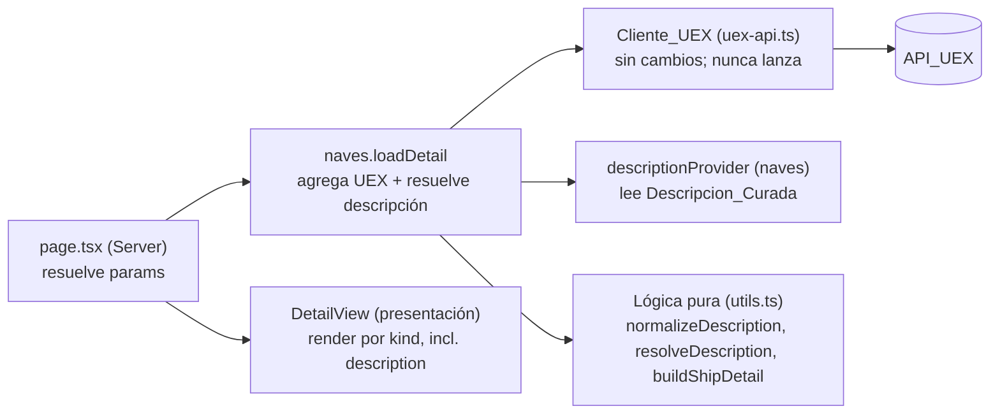

# Design Document

## Overview

Esta funcionalidad es una **mejora incremental** del **Detalle_Elemento** de la wiki. Sobre el **modelo de detalle componible** (`WikiDetail` con `sections: DetailSection[]`) que introdujo la spec `wiki-detalle-completo`, esta mejora añade **un único Tipo_Bloque nuevo**: el **Bloque_Descripcion**, que muestra un texto descriptivo (resumen/lore) del elemento. No rediseña la página de detalle ni altera las presentaciones de los demás bloques (galería, ficha técnica, precios, enlaces).

La pieza central del diseño es que **la API_UEX no expone texto narrativo**. Por eso la descripción no viene de una llamada de datos nueva, sino de un **Proveedor_Descripcion** que cada Categoria_Wiki declara en el Registro_Categorias. En esta entrega (naves), la fuente es **texto curado manualmente en el propio código** (Descripcion_Curada), asociado a cada Nave por su `slug`. La abstracción deja la puerta abierta a que cualquier Categoria_Wiki futura conecte su propia fuente de descripción sin tocar la página de detalle.

El diseño persigue cuatro objetivos, alineados con los requisitos:

1. **Nuevo bloque componible** — añadir `Bloque_Descripcion` como variante de la unión `DetailSection`, renderizable de forma independiente y en la posición que ocupa dentro de la lista ordenada de secciones (Req 1).
2. **Fuente enchufable por categoría** — extender el contrato `WikiCategory` con un `Proveedor_Descripcion` opcional; la página de detalle no conoce categorías concretas (Req 2, 5).
3. **Descripción curada de naves** — mantener las descripciones de naves en código, indexadas por `slug`, sin llamadas a la API_UEX ni a fuentes externas nuevas (Req 3).
4. **Integración resiliente** — resolver la descripción dentro de la agregación del detalle de modo que su ausencia o fallo nunca rompa el resto de la ficha; omitir el bloque por completo cuando no hay texto (Req 4, 6).

El diseño **conserva** todas las convenciones ya establecidas:

- Cliente_UEX (`app/wiki/uex-api.ts`) que **nunca lanza**, devuelve `[]` en error, usa `next: { revalidate }` en [3300, 3900] s, lee de `json.data` y prefiere endpoints masivos `*_all`. **Esta mejora no añade ni modifica ninguna llamada de UEX** (Req 3.5, 4.4).
- Lógica pura aislada en `app/wiki/utils.ts`, cubierta con tests de propiedades (vitest 4 + fast-check 4).
- Server Components por defecto; el Bloque_Descripcion es presentacional, sin interactividad de cliente.
- Marcador de Dato_Faltante (`MISSING_DATA`) y patrón de estados vacíos: cuando no hay texto, **el bloque se omite** (no se muestra una sección vacía ni el marcador) (Req 2.4, 6.1).

### Investigación y decisiones de framework

Conforme a `AGENTS.md`, antes de tocar rutas/componentes/datos se consultó la Documentacion_Next local (`node_modules/next/dist/docs/`). Hallazgos relevantes para esta mejora:

- **`params` es un `Promise`** y se resuelve con `await` en el Server Component del detalle (`01-app/01-getting-started/03-layouts-and-pages.md`). El `page.tsx` actual ya lo hace y **no cambia su contrato** en esta mejora; se conserva (Req 7.2).
- El proyecto **no usa Cache Components**, por lo que aplica el modelo `fetch(..., { next: { revalidate } })` (`01-app/02-guides/caching-without-cache-components.md`). Esta mejora **no introduce llamadas de datos nuevas**, por lo que no añade `fetch` alguno: la descripción se resuelve de forma síncrona desde código (Req 3.5, 4.4).
- **Renderizado como texto plano**: el Bloque_Descripcion se renderiza con nodos de texto de React (`{parrafo}` dentro de elementos `<p>`), que React escapa por defecto. **No** se usa `dangerouslySetInnerHTML`, de modo que el contenido nunca se interpreta como marcado ejecutable (Req 1.5).
- Navegación de regreso con `<Link>` de `next/link` (ya en uso; se conserva) (Req 6.4).

Fuentes consultadas (locales): `node_modules/next/dist/docs/01-app/01-getting-started/03-layouts-and-pages.md`, `.../02-guides/caching-without-cache-components.md`; y la guía de la API en `.kiro/steering/uex-corp-api.md` (confirma que UEX no expone lore/descripción).

## Architecture

### Alcance del cambio

La mejora se circunscribe a la rama del Detalle_Elemento y a los módulos compartidos de la wiki. **No** toca el Cliente_UEX (no hay nuevas fuentes de datos) ni el listado de categorías.

```
app/wiki/types.ts                          → + variante `description` en la unión DetailSection
app/wiki/registry.ts                       → + campo opcional `descriptionProvider` en WikiCategory; + tipo DescriptionProvider
app/wiki/utils.ts                          → + normalizeDescription (puro), + resolveDescription (resiliente); buildShipDetail acepta la descripción ya resuelta e inserta el bloque en su posición canónica
app/wiki/categories/naves-descriptions.ts  → (nuevo) Descripcion_Curada: mapa slug → Texto_Descripcion
app/wiki/categories/naves.ts               → declara descriptionProvider; loadDetail resuelve la descripción y la pasa a buildShipDetail
app/wiki/[category]/[slug]/DetailView.tsx  → + sub-renderer DescriptionSection y su caso en el switch por `kind`
```

Las rutas y páginas genéricas (`page.tsx` del detalle) **no cambian su contrato**: siguen resolviendo `params` (Promise) y delegando en `category.loadDetail(slug)` y en `DetailView`.

### Flujo de datos del detalle enriquecido

```mermaid
sequenceDiagram
    participant U as Usuario
    participant P as page.tsx ([slug])
    participant N as naves.loadDetail
    participant C as Cliente_UEX
    participant D as Descripcion_Curada (código)
    participant X as API_UEX

    U->>P: GET /wiki/naves/aurora-mr
    P->>N: loadDetail("aurora-mr")
    N->>C: Promise.allSettled([vehicles, purchases, rentals, terminals])
    C->>X: GET /vehicles, /vehicles_purchases_prices_all, /vehicles_rentals_prices_all, /terminals
    X-->>C: { data: [...] } | error → []
    C-->>N: [vehicles, purchases, rentals, terminals]
    N->>N: filterSpaceships + buscar por slug
    alt nave encontrada
        N->>D: resolveDescription(descriptionProvider, slug)
        D-->>N: string[] (párrafos) | null  (síncrono, nunca lanza)
        N->>N: buildShipDetail(vehicle, purchases, rentals, terminals, paragraphs)
        N-->>P: WikiDetail (secciones ordenadas; descripción incluida solo si hay texto)
        P-->>U: DetailView (render por kind, incluido `description`)
    else no encontrada
        N-->>P: null
        P-->>U: Estado "no encontrado"
    end
```

> La resolución de la descripción es **síncrona y local** (no es una promesa más en el `Promise.allSettled`), no realiza I/O y nunca lanza. Por eso se resuelve después de localizar la nave y antes de componer las secciones. Su ausencia o fallo no afecta a las demás fuentes ni al resto del detalle (Req 4.2, 4.3).

### Capas



- **Proveedor_Descripcion**: función declarada por la categoría que, dado el `slug` del elemento, devuelve su Texto_Descripcion o su ausencia. Para naves lee la Descripcion_Curada. No hace I/O.
- **Lógica pura** (`utils.ts`): normalización del texto en párrafos y resolución resiliente. Es lo que se cubre con tests de propiedades.
- **naves.loadDetail**: orquesta la agregación de UEX (sin cambios) y, adicionalmente, resuelve la descripción de forma aislada.
- **DetailView**: presentación; añade un sub-renderer para el `kind: "description"`, **independiente de la categoría** (Req 5.4).

### Principio de extensibilidad

El detalle ya es una **lista ordenada de secciones componibles** tipadas mediante una **unión discriminada** por `kind`. Esta mejora añade un valor más al conjunto cerrado (`description`) y su renderer. A partir de ahí:

- **Una categoría existente** habilita la descripción declarando un `descriptionProvider` en su entrada del registro y resolviéndolo en su `loadDetail`. No requiere cambios en la página de detalle ni en las demás presentaciones (Req 2.2, 5.2).
- **Una categoría nueva** se añade al registro con su proveedor y su composición de secciones; expone su detalle enriquecido sin tocar las páginas de las demás categorías (Req 5.3).
- **La presentación del Bloque_Descripcion no conoce la categoría**: recibe solo los párrafos y los renderiza igual para cualquier categoría (Req 5.4).

## Components and Interfaces

### Registro_Categorias — `app/wiki/registry.ts`

Se añade un **tipo de Proveedor_Descripcion** y un **campo opcional** en el contrato `WikiCategory`. El campo es opcional para que las categorías que no aporten descripción no declaren nada (Req 2.3).

```ts
/**
 * Proveedor_Descripcion — dado el identificador (slug) de un elemento de la
 * categoría, resuelve su Texto_Descripcion en bruto o su ausencia. Es
 * resiliente por contrato: NUNCA lanza y devuelve ausencia (null/undefined)
 * cuando no dispone de texto (Req 2.5). Síncrono: no realiza I/O (Req 3.5).
 */
export type DescriptionProvider = (slug: string) => string | null | undefined;

export interface WikiCategory {
  // ...campos existentes (id, label, icon?, status, description, loadItems, loadDetail)...

  /**
   * Fuente de Texto_Descripcion de la categoría. Opcional: cuando una
   * categoría no lo declara, el Detalle_Elemento omite el Bloque_Descripcion
   * para sus elementos (Req 2.3).
   */
  descriptionProvider?: DescriptionProvider;
}
```

> Los selectores existentes (`getCategory`, `getActiveCategories`, `getLandingEntries`) **no cambian**: el campo nuevo es aditivo y opcional.

### Descripcion_Curada — `app/wiki/categories/naves-descriptions.ts` (nuevo)

Mapa estático `slug → Texto_Descripcion` mantenido manualmente dentro del código (Req 3.1, 3.2). No depende de la API_UEX ni de ninguna fuente externa (Req 3.5).

```ts
/**
 * Descripcion_Curada de naves: Texto_Descripcion indexado por el `slug` de la
 * Nave (el mismo que produce `toSlug(resolveShipName(v))`). Mantenida a mano;
 * se amplía añadiendo entradas, sin tocar la página de detalle.
 *
 * Cada valor puede contener varios párrafos separados por una línea en blanco
 * (`\n\n`); `normalizeDescription` los divide para el render.
 */
export const SHIP_DESCRIPTIONS: Record<string, string> = {
  "aurora-mr":
    "La Aurora es la nave inicial por excelencia...\n\nEquilibrada y asequible...",
  // ...más entradas curadas...
};
```

### Categoría "naves" — `app/wiki/categories/naves.ts`

`loadItems` **no cambia**. Se declara `descriptionProvider` y `loadDetail` resuelve la descripción tras localizar la nave, pasándola a `buildShipDetail`:

```ts
import { SHIP_DESCRIPTIONS } from "./naves-descriptions";
import { /* ...existentes... */ resolveDescription } from "../utils";

/** Proveedor_Descripcion de naves: lee la Descripcion_Curada por slug (Req 3.1–3.4). */
const describeShip: DescriptionProvider = (slug) => SHIP_DESCRIPTIONS[slug];

async function loadDetail(slug: string): Promise<WikiDetail | null> {
  const [vehiclesR, purchasesR, rentalsR, terminalsR] =
    await Promise.allSettled([
      fetchVehicles(),
      fetchVehiclePurchasePrices(),
      fetchVehicleRentalPrices(),
      fetchTerminals(),
    ]);

  const vehicles = vehiclesR.status === "fulfilled" ? vehiclesR.value : [];
  const purchases = purchasesR.status === "fulfilled" ? purchasesR.value : [];
  const rentals = rentalsR.status === "fulfilled" ? rentalsR.value : [];
  const terminals = terminalsR.status === "fulfilled" ? terminalsR.value : [];

  const ship = filterSpaceships(vehicles).find(
    (v) => toSlug(resolveShipName(v)) === slug,
  );
  if (!ship) return null;

  // Resolución resiliente y aislada de la descripción (Req 4.1–4.3).
  const paragraphs = resolveDescription(
    navesCategory.descriptionProvider,
    slug,
  );

  return buildShipDetail(ship, purchases, rentals, terminals, paragraphs);
}

export const navesCategory: WikiCategory = {
  id: "naves",
  label: "Naves",
  status: "active",
  description: "Naves de Star Citizen: capacidad, tripulación y más.",
  loadItems,
  loadDetail,
  descriptionProvider: describeShip,
};
```

> `resolveDescription` envuelve la invocación del proveedor en `try/catch` (defensa adicional aunque el contrato ya prohíbe lanzar) y normaliza el texto. Si el proveedor es `undefined`, lanza o devuelve ausencia/espacios, el resultado es `null` y el Bloque_Descripcion se omite (Req 2.3, 2.4, 2.5, 4.3).

### Detalle_Elemento — `app/wiki/[category]/[slug]/page.tsx`

**Sin cambios.** Resuelve `params: Promise<{ category, slug }>`, gestiona "no encontrado" (categoría inexistente/inactiva o `loadDetail` → `null`) y delega en `DetailView` (Req 6.2, 7.2).

### Presentación — `app/wiki/[category]/[slug]/DetailView.tsx`

Se añade el caso `description` al `switch` del `SectionRenderer` y un sub-renderer presentacional. El resto de `DetailView` (encabezado, "Volver al listado", iteración de secciones en orden) **no cambia** (Req 1.6, 6.4).

```tsx
function SectionRenderer({ section }: { section: DetailSection }) {
  switch (section.kind) {
    case "fields":
      return <FieldsSection section={section} />;
    case "gallery":
      return <GallerySection section={section} />;
    case "prices":
      return <PricesSection section={section} />;
    case "links":
      return <LinksSection section={section} />;
    case "description":
      return <DescriptionSection section={section} />;
  }
}

/**
 * Bloque_Descripcion — muestra el Texto_Descripcion como párrafos de texto
 * plano (Req 1.4, 1.5). Cada párrafo es un `<p>` con el texto como nodo hijo,
 * que React escapa por defecto; NO se usa dangerouslySetInnerHTML. Presentación
 * independiente de la categoría (Req 5.4).
 */
function DescriptionSection({
  section,
}: {
  section: Extract<DetailSection, { kind: "description" }>;
}) {
  return (
    <section className="mb-8">
      <h2 className="text-lg font-semibold text-white mb-4">Descripción</h2>
      <div className="space-y-3 text-sm leading-relaxed text-[#BCBEC0]">
        {section.paragraphs.map((paragraph, index) => (
          <p key={index}>{paragraph}</p>
        ))}
      </div>
    </section>
  );
}
```

> El `switch` sobre la unión discriminada es exhaustivo: añadir `description` obliga a TypeScript a cubrir el caso aquí. No se requiere ningún cambio en `page.tsx` ni en los demás sub-renderers (Req 1.6, 5.2).

## Data Models

### Modelo de dominio — `app/wiki/types.ts`

Se **amplía** la unión discriminada `DetailSection` con la variante `description`. El resto de `WikiDetail` y de las variantes existentes **no cambia**.

```ts
/**
 * Seccion_Detalle — unión discriminada por `kind`. Conjunto cerrado de
 * Tipo_Bloque. Cada variante es autónoma y se renderiza de forma independiente.
 */
export type DetailSection =
  | { kind: "fields"; label: string; fields: DetailField[] } // Bloque_Grupo_Campos
  | {
      kind: "gallery";
      mainImage: string | null;
      images: string[];
      altBase: string;
    } // Bloque_Galeria
  | { kind: "prices"; operation: PriceOperation; rows: PriceRow[] } // Bloque_Precios
  | { kind: "links"; links: LinkEntry[] } // Bloque_Enlaces
  | { kind: "description"; paragraphs: string[] }; // Bloque_Descripcion (NUEVO)
```

> **Invariante de la variante `description`**: `paragraphs` es siempre **no vacío** y cada elemento es una cadena **no vacía y sin recortar a espacios en blanco**. La composición (`buildShipDetail`) garantiza que esta variante solo se emite cuando hay texto real; el caso "sin descripción" se representa por **ausencia de la sección**, no por una sección con `paragraphs: []` (Req 2.4, 6.1).

### Helpers puros — `app/wiki/utils.ts`

Se **conservan** todos los helpers existentes. Se **añaden** dos funciones puras y se **amplía la firma** de `buildShipDetail` con un parámetro opcional para la descripción ya resuelta.

| Función                | Firma                                                                                        | Responsabilidad                                                                                                                                                                                                                                                                                                                           |
| ---------------------- | -------------------------------------------------------------------------------------------- | ----------------------------------------------------------------------------------------------------------------------------------------------------------------------------------------------------------------------------------------------------------------------------------------------------------------------------------------- |
| `normalizeDescription` | `(raw: string \| null \| undefined) => string[] \| null`                                     | Convierte el Texto_Descripcion en bruto en una lista de párrafos limpios. Divide por líneas en blanco (`\n\n+`), recorta cada párrafo y descarta los vacíos. Devuelve `null` si la entrada es `null`/`undefined`, cadena vacía, solo espacios en blanco, o si no queda ningún párrafo no vacío. Nunca lanza.                              |
| `resolveDescription`   | `(provider: DescriptionProvider \| undefined, slug: string) => string[] \| null`             | Resolución resiliente: si `provider` es `undefined` devuelve `null` (Req 2.3); en otro caso invoca `provider(slug)` dentro de `try/catch` (ante excepción → `null`, Req 2.5/4.3) y aplica `normalizeDescription` al resultado. Nunca lanza.                                                                                               |
| `buildShipDetail`      | `(v, purchases, rentals, terminals, descriptionParagraphs?: string[] \| null) => WikiDetail` | Igual que hoy, con un parámetro adicional opcional. Cuando `descriptionParagraphs` es una lista **no vacía**, inserta una sección `{ kind: "description", paragraphs }` en su **posición canónica**; cuando es `null`/`undefined`/vacía, **no** añade la sección. Las demás secciones y su orden se conservan sin cambios (Req 1.6, 6.2). |

**Posición canónica del Bloque_Descripcion**: tras la `gallery` y **antes** de la Ficha_Tecnica (`fields`). El orden canónico completo pasa a ser:

1. `gallery` (Bloque_Galeria) — solo si hay imágenes.
2. `description` (Bloque_Descripcion) — **solo si** hay párrafos no vacíos. **(NUEVO)**
3. `fields` "Ficha técnica" (Bloque_Grupo_Campos) — **siempre presente**.
4. `prices` compra — solo si hay filas.
5. `prices` alquiler — solo si hay filas.
6. `links` (Bloque_Enlaces) — solo si hay alguno.

> El bloque se coloca arriba (tras el reconocimiento visual de la galería y antes de los datos técnicos) porque es contexto introductorio del elemento. Cuando la galería y los precios se omiten por falta de datos pero hay descripción, el detalle muestra el Bloque_Descripcion junto con la Ficha_Tecnica, que nunca se omite (Req 6.3). Una categoría futura puede situar su Bloque_Descripcion en otra posición devolviendo sus secciones en el orden que prefiera (Req 5.2).

### Formato del Texto_Descripcion

- **Entrada (Descripcion_Curada)**: una cadena por elemento; los párrafos se separan con una línea en blanco (`\n\n`).
- **Normalización**: `normalizeDescription` divide por `\n\s*\n+`, hace `trim()` de cada fragmento y descarta los vacíos. El resultado es `string[]` (1..n párrafos) o `null`.
- **Salida (Bloque_Descripcion)**: `paragraphs: string[]` no vacío; el renderer muestra un `<p>` por párrafo (Req 1.4).

## Correctness Properties

_A property is a characteristic or behavior that should hold true across all valid executions of a system — essentially, a formal statement about what the system should do. Properties serve as the bridge between human-readable specifications and machine-verifiable correctness guarantees._

Estas propiedades se derivan del prework y cubren la **lógica pura nueva** introducida por esta mejora: la normalización del Texto_Descripcion en párrafos, la resolución resiliente del Proveedor_Descripcion, la Descripcion_Curada de naves y la composición del detalle con el nuevo Bloque_Descripcion. Los criterios de UI (texto plano, render por `kind`, presentación independiente de categoría, navegación de regreso), el wiring de I/O y la resolución en `loadDetail`, la capacidad declarativa del registro, la garantía de "sin solicitudes a la API_UEX" y la conformidad de framework se cubren con tests de ejemplo/componente/integración/smoke (ver Testing Strategy), no como propiedades universales.

Las propiedades **heredadas** de las specs `wiki` y `wiki-detalle-completo` siguen vigentes sin cambios y no se reescriben aquí; en particular, la Property 7 de `wiki-detalle-completo` (composición/orden/omisión de secciones) se **amplía** —no se sustituye— para contemplar la posición canónica del Bloque_Descripcion.

### Property 1: Normalización del Texto_Descripcion (ausencia y división en párrafos)

_Para cualquier_ entrada de Texto_Descripcion: si es `null`, `undefined`, la cadena vacía o una cadena compuesta únicamente por espacios en blanco, `normalizeDescription` devuelve `null`; en caso contrario devuelve una lista **no vacía** de párrafos en la que cada elemento es el resultado de recortar (`trim`) un fragmento separado por líneas en blanco, ningún elemento es vacío ni está compuesto solo por espacios, y el orden de los párrafos se preserva respecto del texto original. `normalizeDescription` nunca lanza.

**Validates: Requirements 1.4, 2.4, 6.1**

### Property 2: Resolución resiliente de la descripción

_Para cualquier_ Proveedor*Descripcion (incluyendo un proveedor `undefined` y un proveedor que lanza una excepción) y \_para cualquier* `slug`, `resolveDescription` nunca lanza y: devuelve `null` cuando el proveedor es `undefined`, cuando el proveedor lanza, o cuando el valor resuelto es un Dato_Faltante, una cadena vacía o una cadena de solo espacios; y devuelve exactamente `normalizeDescription(valorResuelto)` (una lista no vacía de párrafos) cuando el proveedor aporta texto con contenido.

**Validates: Requirements 2.3, 2.5, 4.3**

### Property 3: Proveedor_Descripcion curado de naves indexado por slug

_Para cualquier_ Descripcion*Curada (mapa de `slug` a Texto_Descripcion) y \_para cualquier* `slug`, el Proveedor_Descripcion de naves devuelve el Texto_Descripcion asociado a ese `slug` cuando el mapa contiene una entrada para él, y devuelve la ausencia (`undefined`) cuando el mapa no contiene ninguna entrada para ese `slug`, sin realizar ninguna solicitud externa.

**Validates: Requirements 3.1, 3.2, 3.3, 3.4**

### Property 4: Composición del detalle con el Bloque_Descripcion

_Para cualquier_ `ApiVehicle`, _para cualesquiera_ listas de precios de compra, precios de alquiler y terminales, y _para cualquier_ resultado de descripción (`string[]` no vacío, lista vacía, o `null`/`undefined`), `buildShipDetail` produce un `WikiDetail` que: (a) incluye una sección `{ kind: "description" }` **si y solo si** el resultado de descripción es una lista no vacía, y en tal caso la sección lleva exactamente esos párrafos; (b) cuando incluye la descripción, la sitúa en su posición canónica —después de la `gallery` (si existe) y antes de la Ficha_Tecnica (`fields`)—; (c) conserva la subsecuencia de secciones que NO son de descripción exactamente igual (mismo contenido y orden) que la que produce `buildShipDetail` sin descripción para las mismas entradas, incluyendo la Ficha_Tecnica siempre presente; y (d) emite únicamente `kind` del conjunto cerrado de Tipo_Bloque.

**Validates: Requirements 1.2, 1.3, 1.6, 2.2, 4.2, 5.1, 6.1, 6.3**

## Error Handling

### Resolución de la descripción

- **Proveedor que lanza una excepción**: `resolveDescription` la captura (`try/catch`) y devuelve `null`; el detalle se compone sin Bloque_Descripcion (Property 2; Req 2.5, 4.3).
- **Proveedor ausente** (categoría sin `descriptionProvider`): `resolveDescription` devuelve `null` directamente; el bloque se omite (Property 2; Req 2.3).
- **Texto ausente o vacío** (`null`/`undefined`/`""`/solo espacios o sin párrafos tras normalizar): `normalizeDescription` devuelve `null` y el bloque se omite, sin mostrar sección vacía ni marcador de Dato_Faltante (Property 1, Property 4; Req 2.4, 6.1).

### Agregación del detalle

- **Fuentes de UEX**: sin cambios. `loadDetail` sigue agregando las cuatro fuentes con `Promise.allSettled`; cada origen se reduce a `[]` si su promesa resulta `rejected`. La resolución de la descripción es **independiente y síncrona**, por lo que su resultado no afecta a las demás fuentes ni viceversa (Req 4.2).
- **Descripción presente con resto de secciones omitidas**: cuando galería y precios se omiten por falta de datos pero hay descripción, `buildShipDetail` emite `[description, fields, ...]`, mostrando el Bloque_Descripcion junto con la Ficha_Tecnica, que nunca se omite (Property 4; Req 6.3).

### Estados del detalle (heredados, sin cambios)

- **Nave inexistente** (`loadDetail` → `null`): estado "no encontrado" del `page.tsx` actual (Req 6.2).
- **Navegación de regreso**: el enlace "Volver al listado" de `DetailView` se conserva (Req 6.4).
- **Campos faltantes** de la Ficha_Tecnica: marcador `MISSING_DATA` vía `displayValue`, heredado sin cambios.

## Testing Strategy

Enfoque dual alineado con el toolchain existente (vitest 4 + fast-check 4, `@testing-library/react`, jsdom). Los tests viven en `app/wiki/__tests__/` con los sufijos del repo: `*.property.test.ts`, `*.unit.test.ts`, `*.integration.test.ts`, `*.test.tsx`.

### Tests de propiedades (lógica pura)

Cada propiedad del diseño se implementa con **un único** test de propiedad, **mínimo 100 iteraciones** (`{ numRuns: 100 }`), usando `fast-check`. Cada test se etiqueta con un comentario:

`Feature: wiki-detalle-enriquecido, Property {número}: {texto de la propiedad}`

| Propiedad                                        | Archivo sugerido                         | Generadores clave                                                                                                                                                                            |
| ------------------------------------------------ | ---------------------------------------- | -------------------------------------------------------------------------------------------------------------------------------------------------------------------------------------------- |
| 1 Normalización del Texto_Descripcion            | `normalize-description.property.test.ts` | `fc.oneof` de `null`/`undefined`/`""`/cadenas de solo espacios para la rama de ausencia; arrays de fragmentos con contenido unidos con `\n\n` (y ruido de espacios) para la rama de párrafos |
| 2 Resolución resiliente de la descripción        | `resolve-description.property.test.ts`   | proveedores generados: `undefined`, que lanzan, que devuelven `null`/`undefined`/`""`/espacios, y que devuelven texto con contenido; `slug` arbitrario                                       |
| 3 Proveedor curado de naves por slug             | `ship-descriptions.property.test.ts`     | `fc.dictionary(slug, texto)` para construir mapas curados; `slug` dentro y fuera del mapa                                                                                                    |
| 4 Composición del detalle con Bloque_Descripcion | `description-section.property.test.ts`   | `ApiVehicle` arbitrario + listas de precios/terminales arbitrarias (reutilizando los generadores de `detail-structure.property.test.ts`) + descripción `string[]` no vacía / `[]` / `null`   |

> Para la Property 4, la aserción clave (c) compara la subsecuencia de secciones no-`description` de `buildShipDetail(..., paragraphs)` con la de `buildShipDetail(...)` sin el argumento, demostrando que el bloque nuevo no altera las secciones existentes (Req 1.6, 4.2).

### Tests unitarios y de ejemplo

- `normalizeDescription` con un texto de varios párrafos concreto → lista de párrafos esperada (ejemplo legible que acompaña a la Property 1).
- `naves.loadDetail` incluye el Bloque_Descripcion cuando la Descripcion_Curada tiene entrada para el slug, y lo omite cuando no la tiene (Req 4.1).
- `naves.loadDetail` devuelve `null` para slug inexistente (heredado; Req 6.2).

### Tests de componentes (UI / `@testing-library/react`)

- `DescriptionSection`: renderiza un `<p>` por párrafo, en orden (Req 1.4).
- **Texto plano**: al pasar un párrafo que contiene marcado tipo HTML (p. ej. `"<b>x</b>"` o `"<script>"`), el componente lo muestra como **texto literal** y no crea los nodos correspondientes (sin `dangerouslySetInnerHTML`) (Req 1.5).
- `DetailView`: renderiza un array de secciones que incluye una `description` en una posición arbitraria, despachando al sub-renderer correcto por `kind` y respetando el orden del array (Req 1.3, 5.2); la presentación de la descripción no recibe ni depende de la categoría (Req 5.4).
- Conservación del encabezado y del enlace "Volver al listado" tras añadir el bloque (Req 1.6, 6.4).

### Tests de integración

- Con `global.fetch` mockeado: la ruta de resolución de la descripción (`descriptionProvider` + `resolveDescription`) **no realiza ninguna llamada `fetch`**; el número de invocaciones de `fetch` en `loadDetail` es el mismo que antes de esta mejora (Req 3.5, 4.4).
- Los tests de integración del Cliente_UEX existentes siguen verdes sin cambios (las convenciones de UEX se conservan; no hay nuevas fuentes) (Req 4.4).

### Impacto en tests existentes (migración)

- **`detail-structure.property.test.ts`** (Property 7 de `wiki-detalle-completo`): la firma de `buildShipDetail` gana un parámetro **opcional** (`descriptionParagraphs?`). Las invocaciones existentes (4 argumentos) siguen siendo válidas y no necesitan cambios. Conviene **añadir `"description"` al conjunto `KNOWN_KINDS`** y contemplar la posición canónica del bloque cuando se invoque con descripción, pero las aserciones actuales (sin descripción) se conservan.
- **`DetailView.test.tsx`**: se añaden casos para el `kind: "description"`; los fixtures existentes no necesitan incluir el bloque.
- **`registry.unit.test.ts`**: el campo `descriptionProvider` es opcional y aditivo; los tests existentes de selectores se conservan. Se añade un caso que verifica que una categoría puede declarar el proveedor sin afectar a las demás (Req 2.1, 5.3).

### Conformidad de framework (smoke / proceso)

- Req 7.1–7.3 se garantizan consultando `node_modules/next/dist/docs/` antes de implementar y verificando que `next build` no reporte uso de APIs obsoletas. El `page.tsx` del detalle **no cambia** y ya resuelve `params` como `Promise` (Req 7.2). No son criterios automatizables como propiedades.

### Por qué algunas áreas no usan PBT

El render como texto plano, la selección de sub-renderer por `kind`, la presentación independiente de categoría, la navegación de regreso, el wiring de `loadDetail`, la capacidad declarativa del registro, la ausencia de I/O del proveedor y la conformidad de framework no tienen una entrada/salida que varíe de forma significativa con el input, por lo que se validan con tests de ejemplo, de componente, de integración o smoke, no con propiedades universales.
