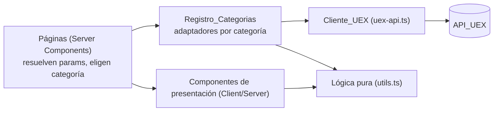
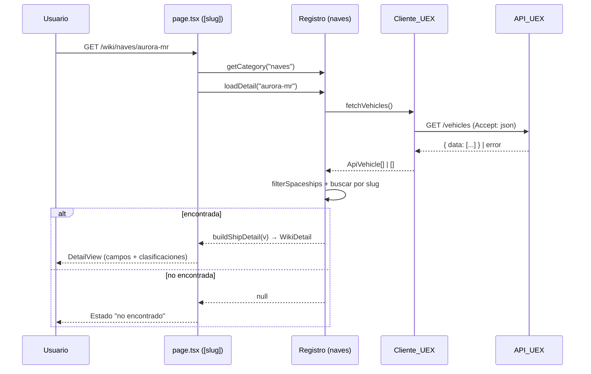

# Design Document

## Overview

La **wiki** es un conjunto de páginas bajo `/wiki` que muestran información de referencia del universo de Star Citizen obtenida de la API pública de UEX Corp (`https://api.uexcorp.uk/2.0`, sin autenticación). El MVP activa **únicamente la categoría "naves"** (`/vehicles` con `is_spaceship`), pero toda la arquitectura gira alrededor de un **Registro_Categorias** declarativo: añadir una categoría nueva (vehículos terrestres, armas, planetas, etc.) debe limitarse a registrar una entrada de configuración, sin tocar las páginas existentes.

El diseño respeta las convenciones ya establecidas en el repositorio para la sección `mercancia`/`mejor-ruta`:

- App Router de Next.js 16 (Server Components por defecto, islas `"use client"` para interacción).
- Cliente UEX en un módulo `uex-api.ts` que **nunca lanza**, devuelve `[]` en error, usa `next: { revalidate }` y lee de `json.data`.
- Ant Design + Tailwind v4 con los tokens visuales oscuros del sitio.
- Lógica pura aislada en `utils.ts` para poder cubrirla con tests de propiedades (vitest + fast-check).

### Investigación y decisiones de framework

Conforme a `AGENTS.md` y a `node_modules/next/dist/docs/`, se confirmaron las convenciones de esta versión modificada de Next.js (16.2.6):

- **`params` y `searchParams` son `Promise`** y deben resolverse con `await` en Server Components (`03-layouts-and-pages.md`, `06-fetching-data.md`). Esto coincide con el patrón ya usado en `app/mercancia/[name]/page.tsx`.
- El proyecto **no usa Cache Components**, por lo que aplica el modelo previo de caché: `fetch(..., { next: { revalidate: <segundos> } })` (`02-guides/caching-without-cache-components.md`). Es exactamente el patrón de `app/mercancia/uex-api.ts`.
- La navegación entre rutas usa `<Link>` de `next/link` y, en componentes cliente, `useRouter`/`usePathname`/`useSearchParams` de `next/navigation` (no APIs obsoletas de Pages Router).
- Estados de carga por segmento mediante `loading.tsx`, como ya hace `mercancia`.

Fuentes consultadas (locales): `node_modules/next/dist/docs/01-app/01-getting-started/03-layouts-and-pages.md`, `.../06-fetching-data.md`, `.../02-guides/caching-without-cache-components.md`; y la guía de la API en `.kiro/steering/uex-corp-api.md`.

## Architecture

### Mapa de rutas

```
/wiki                          → Wiki_Landing (tarjetas de categorías + Buscador_Wiki)
/wiki/[category]               → Listado_Categoria (MVP: naves)
/wiki/[category]/[slug]        → Detalle_Elemento (MVP: detalle de nave)
```

`[category]` es un segmento dinámico cuyo valor debe corresponder al `id` de una entrada del Registro_Categorias. `[slug]` identifica un elemento dentro de esa categoría.

### Diagrama de componentes

```mermaid
graph TD
    subgraph Registro["Registro_Categorias (app/wiki/registry.ts)"]
        REG["WikiCategory[]<br/>id, label, icon, status,<br/>loadItems, loadDetail, detailFields"]
    end

    subgraph Home["Home (app/page.tsx)"]
        HWS["Home_Wiki_Section<br/>(HomeWikiSection.tsx)"]
    end

    subgraph Header["SiteHeader.tsx"]
        NAV["Entrada 'Wiki' → /wiki"]
    end

    subgraph WikiRoutes["Rutas /wiki"]
        LAND["/wiki page.tsx<br/>Wiki_Landing (Server)"]
        SEARCH["WikiSearch.tsx<br/>Buscador_Wiki (Client)"]
        LIST["/wiki/[category] page.tsx<br/>Listado_Categoria (Server)"]
        LISTUI["CategoryList.tsx<br/>filtro por nombre (Client)"]
        DETAIL["/wiki/[category]/[slug] page.tsx<br/>Detalle_Elemento (Server)"]
        DETAILUI["DetailView.tsx (presentación)"]
    end

    subgraph Data["Acceso a datos"]
        API["uex-api.ts<br/>Cliente_UEX (fetchVehicles...)"]
        UTILS["utils.ts<br/>lógica pura"]
        UEX[("API_UEX 2.0")]
    end

    NAV --> LAND
    HWS --> LAND
    HWS -.búsqueda con texto.-> SEARCH
    LAND --> REG
    LAND --> SEARCH
    SEARCH --> REG
    LAND --> LIST
    LIST --> REG
    LIST --> API
    LIST --> LISTUI
    LISTUI --> DETAIL
    DETAIL --> REG
    DETAIL --> API
    DETAIL --> DETAILUI
    REG --> API
    REG --> UTILS
    API --> UEX
    SEARCH --> REG
```



### Principio de extensibilidad

Las páginas (`/wiki`, `/wiki/[category]`, `/wiki/[category]/[slug]`) son **genéricas**: no conocen "naves", solo conocen el `Registro_Categorias`. Cada página:

1. Lee el segmento `[category]` y busca la entrada correspondiente en el registro.
2. Si la categoría no existe o está inactiva, muestra "no encontrado"/"próximamente".
3. Si existe y está activa, delega la carga de datos y la configuración de presentación a la propia entrada de la categoría (`loadItems`, `loadDetail`, `detailFields`).

Añadir una categoría nueva = añadir una entrada al registro con su adaptador de datos y su configuración de campos. No requiere modificar páginas ni el buscador.

### Capas



- **Cliente_UEX** (`uex-api.ts`): solo I/O contra la API. Nunca lanza, devuelve `[]`.
- **Lógica pura** (`utils.ts`): filtros, normalización, parseo de `container_sizes`, resolución de nombre, marcador de dato faltante, búsqueda y filtrado. Es lo que se cubre con tests de propiedades.
- **Registro** (`registry.ts`): conecta categorías con sus adaptadores de datos y configuración de presentación.
- **Páginas/Componentes**: orquestan y presentan.

## Components and Interfaces

### Cliente_UEX — `app/wiki/uex-api.ts`

Sigue exactamente las convenciones de `app/mercancia/uex-api.ts` y del steering de UEX.

```ts
const UEX_API_BASE = "https://api.uexcorp.uk/2.0";

interface UexResponse<T> {
  status: string;
  http_code?: number;
  data: T;
  message?: string;
}

/**
 * Lista completa de vehículos (~278 filas). Endpoint masivo, sin parámetros,
 * sin Authorization. TTL ~1h (entre 3300 y 3900 s) por convención de listados.
 */
export async function fetchVehicles(): Promise<ApiVehicle[]>;
```

Comportamiento garantizado:

- Cabecera `Accept: application/json`, **sin** `Authorization`.
- `next: { revalidate: 3600 }` (dentro del rango exigido 3300–3900 s).
- Lee `json.data ?? []`.
- `try/catch`: ante excepción o `!result.ok`, hace `console.error` y devuelve `[]`.
- Prefiere el endpoint masivo `/vehicles` (no fan-out por elemento), respetando el límite de 120 req/min.

> El detalle de nave también se sirve desde `fetchVehicles()` (filtrando por slug en memoria) para evitar un patrón de una request por elemento. UEX no expone `vehicles_all`; `/vehicles` ya es el endpoint masivo de esta categoría.

### Registro_Categorias — `app/wiki/registry.ts`

```ts
export interface WikiCategory {
  /** Identificador único = segmento de ruta. P.ej. "naves". */
  id: string;
  /** Nombre visible. P.ej. "Naves". */
  label: string;
  /** Icono (Ant Design). */
  icon: React.ReactNode;
  /** "active" se navega; "coming_soon" se muestra deshabilitada. */
  status: "active" | "coming_soon";
  /** Texto corto para la tarjeta de la landing. */
  description: string;
  /** Carga y normaliza los elementos de la categoría. */
  loadItems: () => Promise<WikiListItem[]>;
  /** Carga el detalle de un elemento por slug; null si no existe. */
  loadDetail: (slug: string) => Promise<WikiDetail | null>;
}

export const WIKI_CATEGORIES: WikiCategory[] = [navesCategory /* , ... */];

// Selectores puros (testables, sin React):
export function getCategory(id: string): WikiCategory | undefined;
export function getActiveCategories(categories: WikiCategory[]): WikiCategory[];
export function getLandingEntries(categories: WikiCategory[]): LandingEntry[]; // { id, label, status, navigable }
```

La categoría "naves" (`app/wiki/categories/naves.ts`) implementa `loadItems`/`loadDetail` usando `fetchVehicles()` + helpers puros de `utils.ts`. Es la **única** entrada con `status: "active"` en el MVP; el resto (si se listan) van como `coming_soon`.

### Wiki_Landing — `app/wiki/page.tsx` (Server) + `WikiSearch.tsx` (Client)

- Server Component: deriva las tarjetas de `getLandingEntries(WIKI_CATEGORIES)`. Renderiza una tarjeta por categoría; activas como `<Link href={'/wiki/${id}'}>`, `coming_soon` deshabilitadas con tooltip "Próximamente".
- Incluye `<WikiSearch />` (componente cliente) en la propia página.
- Lee `searchParams` (`Promise`) para precargar el texto recibido desde el Home (`?q=...`).

### Buscador_Wiki — `app/wiki/WikiSearch.tsx` (Client)

- Recibe los elementos buscables de las categorías activas (precargados por la landing o cargados vía un endpoint/acción) y aplica `searchWiki(query, items)` de `utils.ts`.
- Coincidencia **insensible a mayúsculas/minúsculas** sobre el nombre.
- Mientras el texto está vacío, no muestra resultados.
- Cada resultado muestra nombre + etiqueta de categoría y enlaza a `'/wiki/${categoryId}/${slug}'`.
- Sin coincidencias → mensaje "sin resultados".

### Listado_Categoria — `app/wiki/[category]/page.tsx` (Server) + `CategoryList.tsx` (Client)

- Resuelve `params: Promise<{ category: string }>`, busca la categoría en el registro.
- Categoría inexistente/inactiva → estado "no encontrado".
- Activa → `await category.loadItems()` y pasa los `WikiListItem[]` a `CategoryList`.
- `CategoryList` (cliente) ofrece un campo de filtro por nombre (`filterByName`), muestra por cada elemento su nombre y subtítulo (empresa) y enlaza al detalle.
- Lista vacía → mensaje de estado vacío (no una tabla/grid vacía).

### Detalle_Elemento — `app/wiki/[category]/[slug]/page.tsx` (Server) + `DetailView.tsx`

- Resuelve `params: Promise<{ category: string; slug: string }>`.
- Categoría inválida → "no encontrado". Elemento inexistente (`loadDetail` devuelve `null`) → estado "no encontrado".
- `WikiDetail` contiene el título, subtítulo y grupos de campos ya formateados (con marcador de dato faltante aplicado).
- Muestra todas las clasificaciones activas, `container_sizes` como lista numérica, y un control de regreso al `Listado_Categoria` (`<Link href={'/wiki/${category}'}>`).

### Home_Wiki_Section — `app/components/HomeWikiSection.tsx`

- Sección **añadida** a `app/page.tsx` (no reemplaza hero, herramientas ni footer). Se inserta dentro del bloque opaco `bg-[#040d16]`, reutilizando los tokens visuales del Home.
- Título + descripción que identifican la wiki como espacio de información del universo.
- Campo de búsqueda que, al enviar, navega a `/wiki?q=<texto>` mediante `buildWikiSearchHref(query)`.
- Botón/enlace de acceso directo a `/wiki`.

### Header_Navegacion — `app/components/SiteHeader.tsx`

- Añade un ítem de menú `key: "3"`, label `"Wiki"`, `onClick: () => go("/wiki")`, **conservando** "Inicio" y "Herramientas para cargadores" con sus subelementos y su orden.
- `selectedKeys` se extiende: si `pathname` empieza por `/wiki`, selecciona la clave de Wiki.
- El mismo array `items` alimenta el menú horizontal (`>= lg`) y el `Drawer` móvil, así que la entrada aparece en ambos sin trabajo extra.

## Data Models

### Tipos de la API (`app/wiki/types.ts`)

```ts
/** Respuesta del endpoint GET /vehicles */
export interface ApiVehicle {
  id: number;
  name: string;
  name_full: string | null;
  scu: number | null;
  crew: string | null;
  is_spaceship: number; // 0 | 1
  is_cargo: number; // 0 | 1
  is_ground_vehicle: number; // 0 | 1
  container_sizes: string | null; // p.ej. "1,2,4,8,16,24,32"
  pad_type: string | null;
  company_name: string | null;
}
```

### Tipos de dominio de la wiki

```ts
/** Elemento normalizado de un Listado_Categoria. */
export interface WikiListItem {
  id: number | string;
  categoryId: string;
  name: string; // name_full ?? name (para naves)
  slug: string; // derivado del nombre
  subtitle: string; // empresa fabricante para naves
}

/** Resultado del Buscador_Wiki. */
export interface WikiSearchResult {
  name: string;
  categoryId: string;
  categoryLabel: string;
  slug: string;
  href: string; // /wiki/{categoryId}/{slug}
}

/** Un campo ya formateado para la vista de detalle. */
export interface DetailField {
  label: string;
  /** Valor formateado listo para mostrar; usa el marcador si falta el dato. */
  value: string | string[];
}

/** Detalle completo de un elemento. */
export interface WikiDetail {
  categoryId: string;
  title: string; // nombre completo
  subtitle: string; // empresa fabricante
  fields: DetailField[];
  /** Clasificaciones activas, p.ej. ["Nave espacial", "Carga"]. */
  classifications: string[];
}

/** Entrada derivada para la landing (selector puro). */
export interface LandingEntry {
  id: string;
  label: string;
  status: "active" | "coming_soon";
  navigable: boolean; // true solo si status === "active"
}
```

### Helpers puros (`app/wiki/utils.ts`)

| Función                 | Firma                                                          | Responsabilidad                                                  |
| ----------------------- | -------------------------------------------------------------- | ---------------------------------------------------------------- |
| `isSpaceship`           | `(v: ApiVehicle) => boolean`                                   | `true` si `is_spaceship` indica nave.                            |
| `filterSpaceships`      | `(v: ApiVehicle[]) => ApiVehicle[]`                            | Conserva solo naves.                                             |
| `resolveShipName`       | `(v: ApiVehicle) => string`                                    | `name_full` si no está vacío, en caso contrario `name`.          |
| `toSlug`                | `(name: string) => string`                                     | Nombre → slug (minúsculas, guiones).                             |
| `parseContainerSizes`   | `(s: string \| null) => number[]`                              | `"1,2,4"` → `[1,2,4]`; vacío/null → `[]`.                        |
| `displayValue`          | `(v: unknown) => string`                                       | Marcador si `null`/`undefined`; `""` y `0` se muestran tal cual. |
| `activeClassifications` | `(v: ApiVehicle) => string[]`                                  | Etiquetas de cada `is_*` activo.                                 |
| `filterByName`          | `(items: WikiListItem[], q: string) => WikiListItem[]`         | Subconjunto cuyo nombre contiene `q` (case-insensitive).         |
| `searchWiki`            | `(q: string, items: WikiSearchResult[]) => WikiSearchResult[]` | Búsqueda case-insensitive; `q` vacío → `[]`.                     |
| `buildWikiSearchHref`   | `(q: string) => string`                                        | `/wiki?q=<encoded>`.                                             |
| `buildShipDetail`       | `(v: ApiVehicle) => WikiDetail`                                | Compone el `WikiDetail` aplicando los helpers anteriores.        |

Constante: `MISSING_DATA = "Dato no disponible"`.

### Flujo de datos (detalle de nave)



## Correctness Properties

_A property is a characteristic or behavior that should hold true across all valid executions of a system — essentially, a formal statement about what the system should do. Properties serve as the bridge between human-readable specifications and machine-verifiable correctness guarantees._

Las siguientes propiedades se derivan del prework. Cubren la lógica pura de `app/wiki/utils.ts`, los selectores de `registry.ts` y el parser de respuesta del Cliente_UEX. Los criterios de UI, layout, wiring de I/O y conformidad de framework se cubren con tests de ejemplo/integración/smoke (ver Testing Strategy), no como propiedades.

### Property 1: Filtro de naves

_Para cualquier_ lista de `ApiVehicle`, `filterSpaceships` devuelve exactamente los vehículos cuyo `is_spaceship` está activo, sin añadir, omitir ni reordenar el resto del subconjunto.

**Validates: Requirements 4.2**

### Property 2: Resolución de nombre y empresa

_Para cualquier_ `ApiVehicle`, el nombre mostrado es `name_full` cuando este no es un Dato_Faltante ni cadena vacía, y `name` en caso contrario; el subtítulo es `company_name` formateado con el marcador de dato faltante cuando falta.

**Validates: Requirements 4.3, 5.1**

### Property 3: Filtro por nombre del listado

_Para cualquier_ lista de `WikiListItem` y _para cualquier_ texto de filtro, `filterByName` devuelve exactamente el subconjunto de elementos cuyo nombre contiene el texto de forma insensible a mayúsculas/minúsculas: todo elemento coincidente está incluido y ningún elemento no coincidente aparece.

**Validates: Requirements 4.5**

### Property 4: Round-trip de container_sizes

_Para cualquier_ lista de enteros no negativos, unirla con comas y luego aplicar `parseContainerSizes` reproduce la lista original; una cadena vacía o `null` produce la lista vacía.

**Validates: Requirements 5.4**

### Property 5: Marcador de dato faltante

_Para cualquier_ valor, `displayValue` devuelve el marcador `"Dato no disponible"` cuando el valor es `null` o `undefined`, y devuelve la representación textual del valor sin marcador cuando es una cadena vacía o el número cero.

**Validates: Requirements 5.5**

### Property 6: Estructura completa del detalle

_Para cualquier_ `ApiVehicle`, `buildShipDetail` produce una `DetailField` por cada campo configurado para la categoría naves (capacidad `scu`, tripulación `crew`, plataforma `pad_type`, tamaños de contenedor `container_sizes`), en el orden configurado, aplicando el marcador de dato faltante a los campos ausentes.

**Validates: Requirements 5.2**

### Property 7: Clasificaciones activas completas

_Para cualquier_ `ApiVehicle`, `activeClassifications` devuelve exactamente las etiquetas correspondientes a los indicadores `is_*` activos (incluyendo múltiples simultáneos) y ninguna etiqueta de un indicador inactivo.

**Validates: Requirements 5.3**

### Property 8: Búsqueda integral en categorías activas

_Para cualquier_ conjunto de elementos buscables derivado de las categorías activas y _para cualquier_ texto de búsqueda no vacío, todos los resultados de `searchWiki` pertenecen a categorías activas, coinciden con el texto de forma insensible a mayúsculas/minúsculas, e incluyen nombre, etiqueta de categoría y un `href` con la forma `/wiki/{categoryId}/{slug}`.

**Validates: Requirements 6.1, 6.2, 6.3, 3.3**

### Property 9: Texto vacío sin resultados

_Para cualquier_ conjunto de elementos buscables y _para cualquier_ texto compuesto únicamente de espacios en blanco (incluida la cadena vacía), `searchWiki` devuelve una lista vacía.

**Validates: Requirements 6.6**

### Property 10: Entradas de la landing derivadas del registro

_Para cualquier_ Registro_Categorias, `getLandingEntries` produce exactamente una entrada por categoría definida, marca como navegable únicamente a las categorías activas y como no navegable a las `coming_soon`, preservando su identidad (`id`, `label`).

**Validates: Requirements 2.1, 2.5, 3.2**

### Property 11: Round-trip del enlace de búsqueda del Home

_Para cualquier_ texto de búsqueda, `buildWikiSearchHref` produce un enlace cuya ruta es `/wiki` y cuyo parámetro `q`, al decodificarse, es igual al texto original.

**Validates: Requirements 7.4**

### Property 12: Resiliencia y extracción del Cliente_UEX

_Para cualquier_ respuesta simulada de la API_UEX —incluyendo objetos con o sin `data`, estados no 2xx y `fetch` que lanza excepción— el Cliente_UEX devuelve el array de `json.data` cuando existe y una lista vacía en cualquier otro caso, sin propagar nunca una excepción.

**Validates: Requirements 8.3, 8.4**

## Error Handling

### Errores de la API_UEX

- **Excepción de red o `!result.ok`**: el Cliente_UEX captura, hace `console.error` y devuelve `[]`. Las páginas que reciben `[]` muestran estados vacíos coherentes (Property 12; Req 8.4).
- **`json.data` ausente**: se devuelve `[]` (Property 12; Req 8.3).
- **`status: "requests_limit_reached"`**: se trata como respuesta sin datos útiles → `[]`. Se mitiga usando el endpoint masivo `/vehicles` y caché de ~1h (Req 8.2, 8.6).
- **Agregación de varias fuentes** (categorías futuras): `Promise.allSettled`, de modo que el fallo de un origen no impide mostrar los demás (Req 8.5).

### Errores de enrutado y datos faltantes

- **Categoría inexistente o inactiva** en `/wiki/[category]`: estado "no encontrado" (o "próximamente" si está en el registro como `coming_soon`).
- **Elemento inexistente** en `/wiki/[category]/[slug]`: `loadDetail` devuelve `null` → estado "no encontrado" (Req 5.6).
- **Listado vacío**: mensaje de estado vacío en lugar de tabla/grid vacía (Req 4.6).
- **Campos faltantes de un elemento**: marcador "Dato no disponible"; las cadenas vacías y los ceros se muestran tal cual (Req 5.5; Property 5).
- **Búsqueda sin coincidencias**: mensaje "sin resultados" (Req 6.5).

### Estados de carga

- `loading.tsx` por segmento (`/wiki`, `/wiki/[category]`, `/wiki/[category]/[slug]`) para streaming de la UI durante el fetch, siguiendo el patrón de `mercancia`.

## Testing Strategy

Enfoque dual, alineado con el toolchain existente (vitest 4 + fast-check 4, `@testing-library/react`, jsdom). Los tests viven en `app/wiki/__tests__/` con los sufijos del repo: `*.property.test.ts`, `*.unit.test.ts`, `*.integration.test.ts`, `*.test.tsx` (componentes).

### Tests de propiedades (lógica pura)

PBT aplica a `utils.ts`, los selectores de `registry.ts` y el parser del Cliente_UEX, por ser funciones puras con espacios de entrada amplios. Cada propiedad del diseño se implementa con **un único** test de propiedad, **mínimo 100 iteraciones** (`{ numRuns: 100 }`), usando `fast-check` (no se implementa PBT a mano). Cada test se etiqueta con un comentario:

`Feature: wiki, Property {número}: {texto de la propiedad}`

| Propiedad                    | Archivo sugerido                     | Generadores clave                                                                   |
| ---------------------------- | ------------------------------------ | ----------------------------------------------------------------------------------- |
| 1 Filtro de naves            | `filter-spaceships.property.test.ts` | `fc.array` de `ApiVehicle` con `is_spaceship` 0/1                                   |
| 2 Resolución de nombre       | `ship-name.property.test.ts`         | `name_full` nullable/vacío + `name` no vacío                                        |
| 3 Filtro por nombre          | `filter-by-name.property.test.ts`    | lista de items + substrings con casing mixto                                        |
| 4 Round-trip container_sizes | `container-sizes.property.test.ts`   | `fc.array(fc.nat())`                                                                |
| 5 Marcador dato faltante     | `display-value.property.test.ts`     | `fc.oneof` de null/undefined/""/0/strings/números                                   |
| 6 Estructura del detalle     | `detail-structure.property.test.ts`  | `ApiVehicle` arbitrario                                                             |
| 7 Clasificaciones activas    | `classifications.property.test.ts`   | combinaciones de flags `is_*`                                                       |
| 8 Búsqueda integral          | `search.property.test.ts`            | items de categorías activas + queries con casing mixto                              |
| 9 Query vacía sin resultados | `search-empty.property.test.ts`      | strings de solo espacios + items arbitrarios                                        |
| 10 Entradas de landing       | `landing-entries.property.test.ts`   | registros con mezcla active/coming_soon                                             |
| 11 Href de búsqueda          | `search-href.property.test.ts`       | `fc.string()` (incluye espacios, acentos, símbolos)                                 |
| 12 Resiliencia Cliente_UEX   | `uex-client.property.test.ts`        | respuestas con/sin `data`, status 2xx/no-2xx, fetch que lanza (mock `global.fetch`) |

### Tests unitarios y de ejemplo

Para criterios concretos, no universales:

- `getActiveCategories(WIKI_CATEGORIES)` devuelve solo "naves" (Req 3.5).
- Selección del header por pathname (`/wiki`, `/wiki/naves` → seleccionado; `/` → no) (Req 1.3).
- Estados "no encontrado" de categoría/elemento y estado vacío de listado (Req 4.6, 5.6).
- Mensaje "sin resultados" del buscador (Req 6.5).

### Tests de componentes (UI / `@testing-library/react`)

- `SiteHeader`: presencia de "Wiki" → `/wiki`, conservación de "Inicio" y "Herramientas" con orden (Req 1.1, 1.2, 1.4, 1.5, 1.6).
- Landing: una tarjeta por categoría, activas enlazables, inactivas deshabilitadas con tooltip, presencia del buscador (Req 2.2, 2.3, 2.4, 2.6).
- `CategoryList`/Detalle: navegación a detalle, control de regreso (Req 4.4, 5.7).
- `HomeWikiSection`: coexistencia con hero/herramientas/footer, título/descripción, input que navega con el texto, enlace a la landing (Req 7.1, 7.2, 7.3, 7.5).

### Tests de integración del Cliente_UEX

Con `global.fetch` mockeado (1–3 ejemplos representativos, no PBT):

- Cabecera `Accept: application/json` presente y `Authorization` ausente (Req 8.1).
- `next.revalidate` dentro de `[3300, 3900]` (Req 8.2).
- Una sola llamada masiva a `/vehicles` en `loadItems`, sin fan-out por elemento (Req 8.6).
- Agregación con `Promise.allSettled` cuando aplique a categorías futuras (Req 8.5).

### Conformidad de framework (smoke / proceso)

- Req 9.1–9.3 se garantizan consultando `node_modules/next/dist/docs/` antes de implementar y verificando que `next build` no reporte uso de APIs obsoletas. No son criterios automatizables como propiedades.

### Por qué algunas áreas no usan PBT

El renderizado de menús/tarjetas, el layout responsive, los tokens visuales, el wiring de I/O y la conformidad con el framework no tienen una entrada/salida que varíe de forma significativa con el input, por lo que se validan con tests de ejemplo, de componentes, de integración o smoke, no con propiedades universales.
